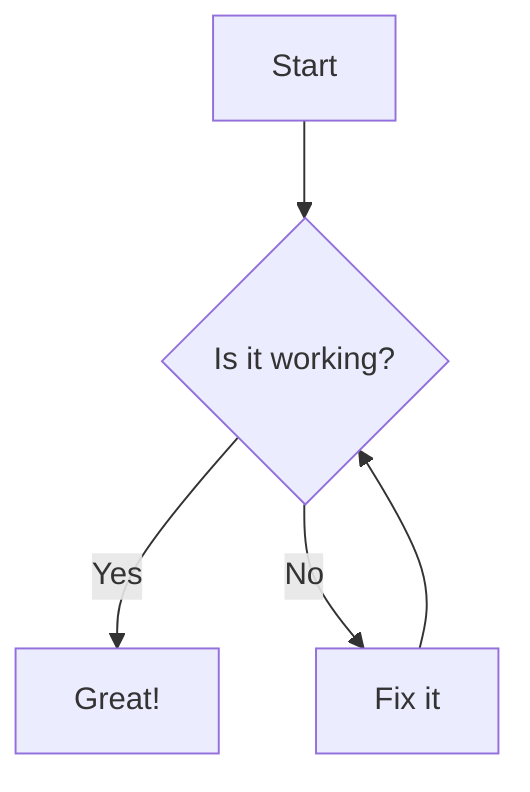

## Hello World

This supports **all markdown features** including:

- Lists
- [Links](https://example.com)
- `inline code`

---

1. Numbered lists
2. More items
3. `code blocks`

---

```typescript
const code: string = "with syntax highlighting";
```

| Tables | Work |
| ------ | ---- |
| Too    | !    |

---

Hello

<div>a ha</div>

---

> This is a blockquote.

---

## Demo shadcn-ui component

### Demo spinner

import { Spinner } from "../../../components/ui/spinner";

<Spinner className="size-8" />

---

## Demo Math

```math
a = \sqrt{a^2 + b^2}
```

```math
b = \sum_{i=1}^\infty\frac{1}{n^2}=\frac{\pi^2}{6}
```

```math
c = \pm\sqrt{a^2 + b^2}
```

```math
E = mc^2
```

```math
v = v_0 + at
```

```math
f(x) = \int_{-\infty}^\infty e^{-t^2} dt
```

```math
L = \frac{1}{2} \rho v^2 S C_L
```

```math
C_L
```

---

## Demo load image

import SocialPreview from "../../shared/assets/social-preview.svg?no-inline";


---

### Demo mermaid diagram


