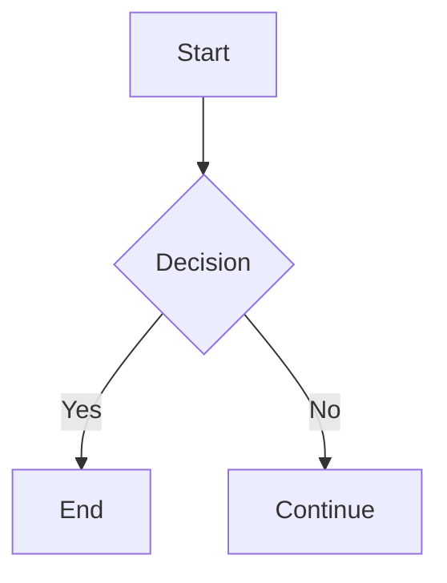

## Blog System - Quick Start Guide

## 🚀 Quick Start

### Create a New Blog Post

1. **Create file** in `app/features/blog/content/`:

```bash
# MDX format
touch app/features/blog/content/my-new-post.mdx

# Or MD format
touch app/features/blog/content/my-new-post.md
```

2. **Add frontmatter and content**:

```mdx
---
title: My Awesome Post
description: This is a great post about React
date: 2025-01-15
author: Your Name
tags: [React, TypeScript, Tutorial]
published: true
---

## Introduction

Your content here...
```

3. **Access your post**:

- View in browser: `http://localhost:5173/blog/my-new-post`
- List all posts: `http://localhost:5173/blog`

## 📝 Frontmatter Fields

| Field         | Required | Type     | Example                 |
| ------------- | -------- | -------- | ----------------------- |
| `title`       | ✅ Yes   | string   | "Getting Started"       |
| `description` | ❌ No    | string   | "Learn the basics"      |
| `date`        | ❌ No    | string   | "2025-01-15"            |
| `author`      | ❌ No    | string   | "John Doe"              |
| `tags`        | ❌ No    | string[] | ["React", "TypeScript"] |
| `published`   | ❌ No    | boolean  | true (default)          |
| `image`       | ❌ No    | string   | "/images/post.jpg"      |

## 🎨 Using Components in MDX

### Import React Components

```mdx
import { Button } from "~/components/ui/button";
import { Spinner } from "~/components/ui/spinner";

<Button>Click me</Button>
<Spinner className="size-8" />
```

### Import Images

```mdx
import MyImage from "~/assets/image.svg?no-inline";


<!-- Or use regular markdown -->


```

## 📚 Code Blocks

### Syntax Highlighting

````mdx
```typescript
interface User {
  name: string;
  age: number;
}

const user: User = { name: "Alice", age: 30 };
```
````

### Supported Languages

- JavaScript/TypeScript
- Python, Go, Rust, Java
- Bash, Shell
- JSON, YAML, TOML
- SQL, GraphQL
- 180+ more via highlight.js

## 📊 Special Features

### Math Equations

````mdx
```math
E = mc^2
```
````

````mdx
```math
f(x) = \int_{-\infty}^\infty e^{-t^2} dt
```
````

### Mermaid Diagrams

````mdx

````

### Tables

```mdx
| Feature    | Status |
| ---------- | ------ |
| MDX        | ✅     |
| MD         | ✅     |
| TypeScript | ✅     |
```

### Blockquotes

```mdx
> This is a blockquote with important information.
```

## 🔧 Development

### Start Dev Server

```bash
bun run dev
```

### Build for Production

```bash
bun run build
```

### Type Check

```bash
bun run typecheck
```

## 📂 File Organization

### Single File

```
content/
  my-post.mdx
```

Access: `/blog/my-post`

### Nested Structure

```
content/
  my-post/
    index.mdx
    images/
      hero.jpg
```

Access: `/blog/my-post`

## 🛠️ Utilities

### Load a Post

```typescript
import { loadBlogPost } from "~/features/blog";

const post = await loadBlogPost("my-post");
```

### Get All Posts

```typescript
import { getAllBlogPosts } from "~/features/blog";

const posts = await getAllBlogPosts();
```

### Search Posts

```typescript
import { searchPosts } from "~/features/blog";

const results = searchPosts(posts, "react");
```

### Filter by Tag

```typescript
import { filterPostsByTag } from "~/features/blog";

const reactPosts = filterPostsByTag(posts, "React");
```

### Format Date

```typescript
import { formatDate } from "~/features/blog";

const formatted = formatDate("2025-01-15"); // "January 15, 2025"
```

## 🎯 Common Patterns

### Draft Posts

```mdx
---
title: Work in Progress
published: false # Won't appear in listings
---
```

### Featured Post

```mdx
---
title: Featured Article
tags: [Featured, Important]
image: /images/featured.jpg
---
```

### Series/Multi-part Posts

```mdx
---
title: "React Tutorial - Part 1"
tags: [React, Tutorial, Series]
---

## Part 1: Getting Started

[Continue to Part 2](/blog/react-tutorial-part-2)
```

## 🐛 Troubleshooting

### Post Not Found

- ✅ Check filename matches URL slug
- ✅ Verify file is in `app/features/blog/content/`
- ✅ Check `published` field isn't false

### Frontmatter Not Working

- ✅ Ensure frontmatter is between `---` markers
- ✅ Check YAML syntax is valid
- ✅ Restart dev server

### Styles Not Applied

- ✅ Check MDX components imported correctly
- ✅ Verify Tailwind classes exist
- ✅ Clear browser cache

### Images Not Loading

- ✅ Use correct import syntax
- ✅ Check image path is correct
- ✅ Verify image exists in public folder or imported

## 📖 Examples

### Minimal Post

```mdx
---
title: Hello World
---

This is my first post!
```

### Complete Post

````mdx
---
title: Advanced React Patterns
description: Deep dive into React design patterns
date: 2025-01-15
author: Jane Smith
tags: [React, TypeScript, Advanced]
published: true
image: /images/react-patterns.jpg
---

## Introduction

In this article, we'll explore...

```typescript
const useCustomHook = () => {
  // Hook implementation
};
```
````

## Conclusion

Thanks for reading!

## 🔗 Useful Links

- **Full Documentation**: `app/features/blog/README.md`
- **Vite Optimizations**: `app/features/blog/VITE_CONFIG_OPTIMIZATIONS.md`
- **Refactoring Summary**: `app/features/blog/REFACTORING_SUMMARY.md`
- **React Router Docs**: [reactrouter.com](https://reactrouter.com)
- **MDX Docs**: [mdxjs.com](https://mdxjs.com)

## 💡 Pro Tips

1. Use descriptive slug names (URL-friendly)
2. Always add `description` for SEO
3. Include `date` for proper sorting
4. Use `tags` for categorization
5. Set `published: false` for drafts
6. Optimize images before uploading
7. Use code blocks with language hints
8. Add alt text to all images
9. Keep posts under 100KB for best performance
10. Test on mobile devices

---

**Ready to start blogging? Create your first post now!** 🎉
