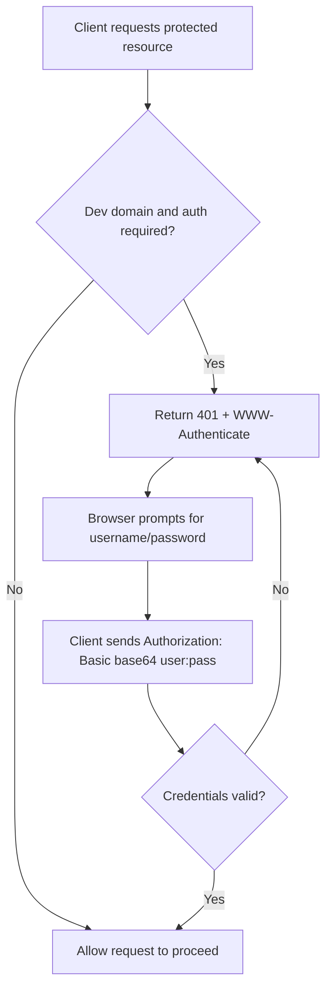

# Dev Domain Basic Auth Middleware Guideline

This document explains how to implement and maintain HTTP Basic Auth for the development domain only.

## Goal

- Require Basic Auth when traffic is served from the development domain.
- Skip Basic Auth on the production domain.
- Keep the implementation simple, explicit, and easy to test.

## Scope

This guideline covers:

- Worker middleware implementation
- Domain host matching strategy
- CI/CD secret wiring for manual Cloudflare deployment
- Validation and troubleshooting

## Prerequisites

You should have:

- A Cloudflare Worker deployment with separate production and development routes
- Domain env variables configured:
  - `VITE_PROD_DOMAIN`
  - `VITE_DEV_DOMAIN`
- Repository secrets configured for dev protection:
  - `BASIC_AUTH_USERNAME`
  - `BASIC_AUTH_PASSWORD`

## File Structure

Recommended module split (one exported symbol per file):

- `workers/middleware/dev-domain-basic-auth/normalizeHost.ts`
- `workers/middleware/dev-domain-basic-auth/hasValidBasicAuth.ts`
- `workers/middleware/dev-domain-basic-auth/devDomainBasicAuthMiddleware.ts`
- `workers/middleware/dev-domain-basic-auth/index.ts`

Usage entry point:

- `workers/app.ts`

## Implementation Steps

### 1) Normalize host values

Normalize host from both incoming requests and env values to avoid mismatch caused by protocol/casing/path differences.

```typescript
export function normalizeHost(value: string | undefined): string | null {
  if (!value) return null;

  const trimmed = value.trim();
  if (!trimmed) return null;

  // Accept "example.com", "https://example.com", "http://example.com",
  // and accidental chained schemes like "https://https://example.com".
  const withoutProtocol = trimmed.replace(/^(?:(?:https?):\/\/)+/i, "");
  if (!withoutProtocol) return null;

  // Reject non-http(s) scheme injection after stripping leading protocols.
  if (/^[a-z][a-z0-9+.-]*:\/\//i.test(withoutProtocol)) return null;

  try {
    return new URL(`https://${withoutProtocol}`).host.toLowerCase();
  } catch {
    const fallbackHost = withoutProtocol
      .toLowerCase()
      .split("/")[0]
      .split("?")[0]
      .split("#")[0];
    return fallbackHost || null;
  }
}
```

This normalization is intentionally defensive for CI/CD env values that may already contain `https://`, including accidental duplicated protocol prefixes.

### 2) Validate Basic Auth credentials

Parse Authorization header and compare decoded credentials.

```typescript
export function hasValidBasicAuth(
  request: Request,
  username: string,
  password: string,
): boolean {
  const authHeader = request.headers.get("Authorization");
  if (!authHeader?.startsWith("Basic ")) return false;

  const encoded = authHeader.slice(6).trim();
  if (!encoded) return false;

  try {
    const decoded = atob(encoded);
    const separatorIndex = decoded.indexOf(":");
    if (separatorIndex === -1) return false;

    const receivedUser = decoded.slice(0, separatorIndex);
    const receivedPassword = decoded.slice(separatorIndex + 1);

    return receivedUser === username && receivedPassword === password;
  } catch {
    return false;
  }
}
```

### 3) Build dev-domain-only middleware

Apply challenge only when request host matches development domain.

```typescript
import type { MiddlewareHandler } from "hono";

import { hasValidBasicAuth } from "./hasValidBasicAuth";
import { normalizeHost } from "./normalizeHost";

export const devDomainBasicAuthMiddleware: MiddlewareHandler<{
  Bindings: Env;
}> = async (c, next) => {
  const requestHost = normalizeHost(new URL(c.req.url).host);
  const configuredDevDomain = import.meta.env.VITE_DEV_DOMAIN;
  const devHost = normalizeHost(configuredDevDomain);

  if (requestHost && devHost && requestHost === devHost) {
    const username = c.env.BASIC_AUTH_USERNAME;
    const password = c.env.BASIC_AUTH_PASSWORD;

    if (
      !username ||
      !password ||
      !hasValidBasicAuth(c.req.raw, username, password)
    ) {
      return c.newResponse("Authentication required", 401, {
        "WWW-Authenticate": 'Basic realm="Development"',
      });
    }
  }

  return next();
};
```

### 4) Register middleware in worker app

Register globally before route handling.

```typescript
import { devDomainBasicAuthMiddleware } from "./middleware/dev-domain-basic-auth";

const app = new Hono<{ Bindings: Env }>();

app.use("*", devDomainBasicAuthMiddleware);
```

## Deployment Workflow Guidance

For manual Cloudflare deploy workflow:

- Always validate base deploy secrets (Cloudflare + D1)
- Validate Basic Auth secrets only for non-main branch deployment
- Export Basic Auth secrets to runtime env

Example logic:

```bash
if [ "${{ github.event.inputs.branch }}" != "main" ]; then
  [ -z "${{ secrets.BASIC_AUTH_USERNAME }}" ] && missing+=("BASIC_AUTH_USERNAME")
  [ -z "${{ secrets.BASIC_AUTH_PASSWORD }}" ] && missing+=("BASIC_AUTH_PASSWORD")
fi
```

Deploy command should target the selected Cloudflare environment:

```bash
bun run deploy -- --env="$CLOUDFLARE_ENV"
```

## Behavior Matrix

| Request host     | Basic Auth required | Expected result                              |
| ---------------- | ------------------- | -------------------------------------------- |
| VITE_DEV_DOMAIN  | Yes                 | 401 challenge if missing/invalid credentials |
| VITE_PROD_DOMAIN | No                  | Request continues normally                   |
| Other hosts      | No                  | Request continues normally                   |

## Security Notes

- Use strong random credentials for development Basic Auth.
- Store credentials only in encrypted CI/CD secrets.
- Never hardcode credentials in source code.
- Rotate credentials if exposed.
- Keep Basic Auth as a guard layer, not a replacement for application authentication.

## Validation Checklist

- Development domain prompts for browser username/password.
- Valid credentials allow normal page and API access.
- Invalid credentials return 401 with `WWW-Authenticate` header.
- Production domain is reachable without Basic Auth prompt.
- CI/CD workflow fails non-main deploy when Basic Auth secrets are missing.

## Troubleshooting

### No auth prompt on development domain

- Confirm request host exactly matches normalized `VITE_DEV_DOMAIN`.
- Confirm middleware is registered before routes.
- Confirm deployment branch maps to development route.
- Confirm deploy uses `--env="$CLOUDFLARE_ENV"` so the `development` environment is actually selected.

### Prompt appears on production

- Check whether production route/domain was misconfigured.
- Confirm `VITE_DEV_DOMAIN` value is not equal to production host.

### Always unauthorized with correct credentials

- Verify Authorization header is sent by client/proxy.
- Re-check secret values for typo or accidental whitespace.
- Ensure credential format is `username:password` before Base64 encoding.

## Conclusion

This approach gives lightweight protection to the development domain while preserving frictionless access for production users. Keep the logic host-based, secret-driven, and centrally enforced in middleware for predictable behavior.

---

## Technical Introduction: How Basic Auth Works

HTTP Basic Authentication is a challenge-response mechanism defined at the HTTP header level.

Flow overview:

1. Client requests a protected resource.
2. Server responds with status `401 Unauthorized` and `WWW-Authenticate: Basic realm="..."`.
3. Browser (or client) prompts for username/password.
4. Client sends `Authorization: Basic <base64(username:password)>`.
5. Server decodes and validates credentials.
6. If valid, request continues. If invalid, server returns `401` again.



Important details:

- Base64 is encoding, not encryption.
- Always use HTTPS so credentials are protected in transit.
- Credentials are sent on every protected request once the browser stores them for the session.
- Basic Auth is good for perimeter protection, but not a full app identity/authorization system.

## Implementation Deep Dive

### 1) Trigger auth only for development domain

Why:

- Production must stay publicly accessible.
- Development domain should be restricted.

How:

- Read request host from `new URL(c.req.url).host`.
- Read development domain from `import.meta.env.VITE_DEV_DOMAIN`.
- Normalize both request host and `VITE_DEV_DOMAIN`.
- Enforce auth only when they match.
- Strip repeated `http://` or `https://` prefixes and reject non-http(s) scheme injection patterns.

### 2) Return a standards-compliant challenge

When credentials are missing or invalid:

```typescript
return c.newResponse("Authentication required", 401, {
  "WWW-Authenticate": 'Basic realm="Development"',
});
```

This header is what triggers browser login prompt behavior.

### 3) Parse and verify credentials safely

Implementation pattern:

- Check header starts with `Basic `.
- Decode payload using `atob`.
- Split on the first `:` to recover username and password.
- Compare to expected values from secrets.
- Wrap decode in `try/catch` to handle malformed input.

### 4) Keep credentials out of source code

Use runtime secrets only:

- `BASIC_AUTH_USERNAME`
- `BASIC_AUTH_PASSWORD`

If either secret is missing on dev domain requests, fail closed (`401`) instead of allowing access.

### 5) Register middleware early

Place middleware registration before route handling in worker app setup:

```typescript
app.use("*", devDomainBasicAuthMiddleware);
```

This ensures every incoming request on the protected host is filtered first.

## Minimal End-to-End Checklist

1. Add middleware and host matching logic.
2. Wire secrets in deployment workflow.
3. Ensure non-main deploy validates Basic Auth secrets.
4. Verify dev domain prompts for credentials.
5. Verify prod domain does not prompt.
6. Verify invalid credentials always return `401`.

## Practical Limitations

- Basic Auth has no built-in logout semantics at protocol level.
- Shared credentials are coarse-grained and not user-specific.
- Not suitable as the only protection for sensitive business operations.

Use it as a lightweight gate in front of development environments, then rely on application auth for user/session-level control.
