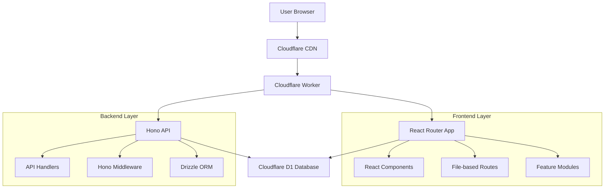
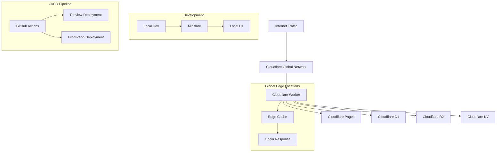

# Architecture Deep Dive

This document provides a comprehensive overview of the NARA boilerplate architecture, design patterns, and technical decisions.

## 📋 Table of Contents

- [🏗 Architecture Overview](#-architecture-overview)
- [🎯 Design Principles](#-design-principles)
- [🧱 Layer Architecture](#-layer-architecture)
- [🌊 Data Flow Patterns](#-data-flow-patterns)
- [🧩 Component Architecture](#-component-architecture)
- [🔄 State Management Patterns](#-state-management-patterns)
- [🚀 Performance Optimizations](#-performance-optimizations)
- [🔒 Security Architecture](#-security-architecture)
- [📈 Scalability Patterns](#-scalability-patterns)
- [🧪 Testing Architecture](#-testing-architecture)
- [🔧 Development Tools Integration](#-development-tools-integration)
- [🌐 Deployment Architecture](#-deployment-architecture)
- [📊 Monitoring and Observability](#-monitoring-and-observability)
- [🔄 Error Handling Architecture](#-error-handling-architecture)
- [🎨 Advanced Architectural Patterns](#-advanced-architectural-patterns)

---

## 🏗 Architecture Overview

The NARA boilerplate implements a **modern full-stack architecture** that emphasizes:

- **Type Safety** - End-to-end TypeScript coverage
- **Performance** - Edge deployment with SSR
- **Developer Experience** - Fast HMR, excellent tooling
- **Scalability** - Feature-based organization
- **Edge-First** - Cloudflare Workers runtime



---

## 🎯 Design Principles

### 1. **Type-Safe End-to-End**

Every layer of the application is typed:

```typescript
// Database Schema (Drizzle)
export const users = sqliteTable("users", {
  id: integer("id").primaryKey(),
  email: text("email").notNull(),
});

// API Handler (Hono)
app.get("/users/:id", async (c) => {
  const id = Number(c.req.param("id"));
  const user = await db.select().from(users).where(eq(users.id, id));
  return c.json(user); // TypeScript knows the shape
});

// Frontend (React Router)
export async function loader({ params }: LoaderFunctionArgs) {
  const response = await fetch(`/api/users/${params.id}`);
  return response.json(); // Type-safe through API contract
}
```

### 2. **Feature-Based Organization**

Features are self-contained modules with their own:

- Components
- Business logic (utils)
- Type definitions
- Context/state management

```text
/features/user-management/
  /components/
    user-list.tsx
    user-form.tsx
  /utils/
    user-validation.ts
    user-api.ts
  /types/
    user.types.ts
  /context/
    user-context.tsx
  page.tsx              # Main feature component
```

### 3. **Progressive Enhancement**

The application works without JavaScript and enhances with it:

```tsx
// Forms work without JS
<form method="post" action="/login">
  <input name="email" required />
  <button type="submit">Login</button>
</form>;

// Enhanced with React
export async function action({ request }: ActionFunctionArgs) {
  const formData = await request.formData();
  const email = formData.get("email");
  // Handle login...
}
```

---

## 🧱 Layer Architecture

### **1. Presentation Layer (React)**

**Responsibilities:**

- User interface rendering
- User interaction handling
- Client-side state management
- Route-based code splitting

**Key Patterns:**

```tsx
// Component with data loading
export async function loader() {
  return { data: await fetchData() };
}

export default function Component() {
  const { data } = useLoaderData<typeof loader>();
  return <div>{data}</div>;
}

// Component with mutations
export async function action({ request }: ActionFunctionArgs) {
  const formData = await request.formData();
  return redirect("/success");
}

export default function FormComponent() {
  return (
    <Form method="post">
      <input name="field" />
      <button type="submit">Submit</button>
    </Form>
  );
}
```

### **2. API Layer (Hono)**

**Responsibilities:**

- HTTP request handling
- Business logic orchestration
- Data validation
- Authentication/authorization

**Key Patterns:**

```tsx
// RESTful API design
const api = new Hono();

// Middleware
api.use("*", async (c, next) => {
  // Auth, logging, etc.
  await next();
});

// Route handlers
api.get("/users", async (c) => {
  const users = await db.select().from(usersTable);
  return c.json(users);
});

api.post("/users", async (c) => {
  const body = await c.req.json();
  const validatedData = userSchema.parse(body);
  const newUser = await db.insert(usersTable).values(validatedData);
  return c.json(newUser, 201);
});
```

### **3. Data Layer (Drizzle + D1)**

**Responsibilities:**

- Data persistence
- Query optimization
- Schema management
- Migration handling

**Key Patterns:**

```typescript
// Schema definition
export const users = sqliteTable("users", {
  id: integer("id").primaryKey(),
  email: text("email").notNull().unique(),
  createdAt: integer("created_at", { mode: "timestamp" }).default(
    sql`CURRENT_TIMESTAMP`,
  ),
});

// Relations
export const posts = sqliteTable("posts", {
  id: integer("id").primaryKey(),
  userId: integer("user_id").references(() => users.id),
  title: text("title").notNull(),
});

export const usersRelations = relations(users, ({ many }) => ({
  posts: many(posts),
}));

// Queries
const usersWithPosts = await db.query.users.findMany({
  with: { posts: true },
});
```

---

## 🌊 Data Flow Patterns

### **Server-Side Rendering (SSR)**

1. **Request** → Cloudflare Worker
2. **Route Resolution** → React Router matches route
3. **Data Loading** → Loader functions fetch data
4. **Rendering** → React renders to HTML
5. **Hydration** → Client takes over

```tsx
// SSR-friendly data loading
export async function loader() {
  // Runs on server for SSR, client for navigation
  const data = await db.select().from(table);
  return { data };
}

export default function Page() {
  const { data } = useLoaderData<typeof loader>();
  // Renders on server and client
  return <div>{data}</div>;
}
```

### **Client-Side Navigation**

1. **Link Click** → React Router intercepts
2. **Loader Execution** → Fetch new data
3. **Component Update** → React re-renders
4. **Optimistic Updates** → Immediate UI feedback

```tsx
// Optimistic UI patterns
export async function action({ request }: ActionFunctionArgs) {
  const formData = await request.formData();
  // Perform mutation
  return { success: true };
}

export default function OptimisticForm() {
  const actionData = useActionData<typeof action>();
  const navigation = useNavigation();

  const isSubmitting = navigation.state === "submitting";

  return (
    <Form method="post">
      <button disabled={isSubmitting}>
        {isSubmitting ? "Saving..." : "Save"}
      </button>
    </Form>
  );
}
```

---

## 🧩 Component Architecture

### **Component Hierarchy**

```text
App (root.tsx)
├── Layout Components
│   ├── Header
│   ├── Navigation
│   └── Footer
├── Route Components
│   ├── Feature Pages
│   └── Shared Pages
└── UI Components (shadcn/ui)
    ├── Primitives (Button, Input)
    ├── Composites (Card, Form)
    └── Complex (DataTable, Charts)
```

### **Component Patterns**

#### **1. Container/Presentation Pattern**

```tsx
// Container (handles data/logic)
export async function loader() {
  const users = await fetchUsers();
  return { users };
}

export default function UsersPage() {
  const { users } = useLoaderData<typeof loader>();
  return <UserList users={users} />;
}

// Presentation (pure UI)
interface UserListProps {
  users: User[];
}

export function UserList({ users }: UserListProps) {
  return (
    <div>
      {users.map((user) => (
        <UserCard key={user.id} user={user} />
      ))}
    </div>
  );
}
```

#### **2. Compound Component Pattern**

```tsx
// Flexible, composable components
export function Card({ children, ...props }) {
  return <div className="card" {...props}>{children}</div>
}

Card.Header = function CardHeader({ children }) {
  return <div className="card-header">{children}</div>
}

Card.Content = function CardContent({ children }) {
  return <div className="card-content">{children}</div>
}

// Usage
<Card>
  <Card.Header>Title</Card.Header>
  <Card.Content>Content</Card.Content>
</Card>
```

#### **3. Render Props/Children as Function**

```tsx
// Flexible data sharing
function DataProvider({ children, query }) {
  const { data, loading, error } = useQuery(query);

  return children({ data, loading, error });
}

// Usage
<DataProvider query="users">
  {({ data, loading, error }) =>
    loading ? <Spinner /> : <UserList users={data} />
  }
</DataProvider>;
```

---

## 🔄 State Management Patterns

### **Server State (React Router)**

For data that originates from the server:

```tsx
// Automatic server state management
export async function loader() {
  return { users: await fetchUsers() };
}

export default function Component() {
  const { users } = useLoaderData<typeof loader>();
  // React Router handles caching, revalidation, etc.
}
```

### **Client State (React + Context)**

For UI state and client-specific data:

```tsx
// Feature-level context
interface UserContextType {
  selectedUser: User | null;
  setSelectedUser: (user: User) => void;
}

const UserContext = createContext<UserContextType>();

export function UserProvider({ children }) {
  const [selectedUser, setSelectedUser] = useState<User | null>(null);

  return (
    <UserContext.Provider value={{ selectedUser, setSelectedUser }}>
      {children}
    </UserContext.Provider>
  );
}

export const useUserContext = () => useContext(UserContext);
```

### **Form State (React Hook Form)**

For complex form handling:

```tsx
import { zodResolver } from "@hookform/resolvers/zod";
import { useForm } from "react-hook-form";

const userSchema = z.object({
  email: z.email(),
  name: z.string().min(1),
});

export function UserForm() {
  const form = useForm({
    resolver: zodResolver(userSchema),
    defaultValues: { email: "", name: "" },
  });

  return (
    <Form {...form}>
      <form onSubmit={form.handleSubmit(onSubmit)}>
        <FormField name="email" />
        <FormField name="name" />
        <Button type="submit">Submit</Button>
      </form>
    </Form>
  );
}
```

---

## 🚀 Performance Optimizations

### **Code Splitting**

Routes are automatically code-split:

```tsx
// Each route is a separate bundle
export default function LazyRoute() {
  return <div>This route loads when needed</div>;
}
```

### **Database Optimizations**

```typescript
// Efficient queries with Drizzle
const usersWithPostCount = await db
  .select({
    id: users.id,
    name: users.name,
    postCount: count(posts.id),
  })
  .from(users)
  .leftJoin(posts, eq(users.id, posts.userId))
  .groupBy(users.id);
```

### **Caching Strategies**

```tsx
// React Router handles route-level caching
export async function loader({ request }) {
  // Cache headers for edge caching
  return new Response(JSON.stringify(data), {
    headers: {
      "Cache-Control": "public, max-age=300",
    },
  });
}
```

---

---

## 🔒 Security Architecture

### **Defense in Depth Strategy**

The NARA boilerplate implements multiple layers of security:

```text
┌─────────────────────────────────────┐
│           CDN Layer                 │ ← DDoS Protection, Rate Limiting
├─────────────────────────────────────┤
│        Edge Worker Layer            │ ← Authentication, CSP Headers
├─────────────────────────────────────┤
│       Application Layer             │ ← Input Validation, CSRF Protection
├─────────────────────────────────────┤
│         Data Layer                  │ ← SQL Injection Prevention, Encryption
└─────────────────────────────────────┘
```

### **Authentication & Authorization Architecture**

```typescript
// Multi-layer auth architecture
interface AuthContext {
  user: User | null;
  permissions: Permission[];
  session: Session | null;
}

// JWT-based authentication with refresh tokens
export class AuthService {
  async authenticate(credentials: LoginCredentials): Promise<AuthResult> {
    const user = await this.validateCredentials(credentials);

    const accessToken = await this.generateAccessToken(user, {
      expiresIn: "15m",
    });
    const refreshToken = await this.generateRefreshToken(user, {
      expiresIn: "7d",
    });

    // Store refresh token in secure HTTP-only cookie
    await this.storeRefreshToken(refreshToken, user.id);

    return { user, accessToken, refreshToken };
  }

  async authorize(
    user: User,
    resource: string,
    action: string,
  ): Promise<boolean> {
    const permissions = await this.getUserPermissions(user.id);
    return this.rbac.check(permissions, resource, action);
  }
}

// Role-Based Access Control (RBAC)
export class RBACService {
  private permissions = new Map<string, Permission[]>();

  async check(
    userPermissions: Permission[],
    resource: string,
    action: string,
  ): Promise<boolean> {
    return userPermissions.some(
      (permission) =>
        permission.resource === resource && permission.actions.includes(action),
    );
  }

  async checkHierarchy(userRole: Role, requiredRole: Role): Promise<boolean> {
    const hierarchy = ["user", "moderator", "admin", "super_admin"];
    const userLevel = hierarchy.indexOf(userRole.name);
    const requiredLevel = hierarchy.indexOf(requiredRole.name);
    return userLevel >= requiredLevel;
  }
}
```

### **Input Validation & Sanitization Pipeline**

```typescript
// Multi-layer validation architecture
export class ValidationPipeline {
  private validators: Validator[] = [];

  constructor() {
    this.validators = [
      new SchemaValidator(), // Zod schema validation
      new SanitizationValidator(), // XSS/injection prevention
      new BusinessRuleValidator(), // Domain-specific rules
      new RateLimitValidator(), // Abuse prevention
    ];
  }

  async validate(
    input: unknown,
    context: ValidationContext,
  ): Promise<ValidationResult> {
    let result = { valid: true, data: input, errors: [] };

    for (const validator of this.validators) {
      result = await validator.validate(result.data, context);
      if (!result.valid) {
        break;
      }
    }

    return result;
  }
}

// Schema validation with detailed security rules
const secureUserSchema = z.object({
  email: z
    .email("Invalid email format")
    .max(254, "Email too long") // RFC 5321 limit
    .refine((email) => !email.includes("+"), "Plus addressing not allowed")
    .transform((email) => email.toLowerCase().trim()),

  password: z
    .string()
    .min(12, "Password must be at least 12 characters")
    .max(128, "Password too long")
    .regex(
      /^(?=.*[a-z])(?=.*[A-Z])(?=.*\d)(?=.*[@$!%*?&])[A-Za-z\d@$!%*?&]/,
      "Password must contain uppercase, lowercase, number, and special character",
    )
    .refine(
      (password) => !commonPasswords.includes(password),
      "Password too common",
    ),

  name: z
    .string()
    .min(1, "Name required")
    .max(100, "Name too long")
    .regex(/^[a-zA-Z\s'-]+$/, "Name contains invalid characters")
    .transform((name) => name.trim().replace(/\s+/g, " ")), // Normalize whitespace
});
```

### **Content Security Policy (CSP) Architecture**

```typescript
// Dynamic CSP generation based on environment
export class CSPBuilder {
  private policies: Map<string, string[]> = new Map();

  constructor(private environment: Environment) {
    this.setupBasePolicies();
  }

  private setupBasePolicies() {
    this.policies.set("default-src", ["'self'"]);
    this.policies.set("script-src", [
      "'self'",
      ...(this.environment === "development" ? ["'unsafe-eval'"] : []),
      "https://static.cloudflareinsights.com",
    ]);
    this.policies.set("style-src", [
      "'self'",
      "'unsafe-inline'",
      "https://fonts.googleapis.com",
    ]);
    this.policies.set("font-src", ["'self'", "https://fonts.gstatic.com"]);
    this.policies.set("img-src", ["'self'", "data:", "https:"]);
    this.policies.set("connect-src", ["'self'", "https://api.example.com"]);
  }

  addSource(directive: string, source: string): this {
    if (!this.policies.has(directive)) {
      this.policies.set(directive, []);
    }
    this.policies.get(directive)!.push(source);
    return this;
  }

  build(): string {
    return Array.from(this.policies.entries())
      .map(([directive, sources]) => `${directive} ${sources.join(" ")}`)
      .join("; ");
  }
}
```

### **SQL Injection Prevention Architecture**

```typescript
// Safe database access patterns
export class SecureDataAccess {
  private db: DrizzleDB;

  // ✅ Always use parameterized queries
  async findUserByEmail(email: string): Promise<User | null> {
    const [user] = await this.db
      .select()
      .from(users)
      .where(eq(users.email, email)) // Automatically parameterized
      .limit(1);

    return user || null;
  }

  // ✅ Safe dynamic queries with query builder
  async searchUsers(filters: UserSearchFilters): Promise<User[]> {
    let query = this.db.select().from(users);

    if (filters.name) {
      query = query.where(like(users.name, `%${filters.name}%`));
    }

    if (filters.role) {
      query = query.where(eq(users.role, filters.role));
    }

    return await query.limit(filters.limit || 50);
  }

  // ❌ Never do this - vulnerable to SQL injection
  // async unsafeQuery(userInput: string) {
  //   return await this.db.execute(`SELECT * FROM users WHERE name = '${userInput}'`)
  // }
}
```

---

## 🌐 Deployment Architecture

### **Edge-First Deployment Strategy**



### **Multi-Environment Architecture**

```typescript
// Environment-specific configurations
interface EnvironmentConfig {
  name: "development" | "staging" | "production";
  database: {
    url: string;
    maxConnections: number;
    queryTimeout: number;
  };
  cache: {
    ttl: number;
    prefix: string;
  };
  security: {
    jwtSecret: string;
    corsOrigins: string[];
    rateLimits: RateLimitConfig;
  };
  monitoring: {
    enableMetrics: boolean;
    logLevel: LogLevel;
    sentryDsn?: string;
  };
}

export class EnvironmentManager {
  private config: EnvironmentConfig;

  constructor(env: Env) {
    this.config = this.loadConfig(env);
  }

  private loadConfig(env: Env): EnvironmentConfig {
    const baseConfig = {
      name: env.ENVIRONMENT,
      database: {
        url: env.DATABASE_URL,
        maxConnections: 10,
        queryTimeout: 30000,
      },
      cache: {
        ttl: 300, // 5 minutes
        prefix: `nara:${env.ENVIRONMENT}:`,
      },
      security: {
        jwtSecret: env.JWT_SECRET,
        corsOrigins: env.CORS_ORIGINS?.split(",") || [],
        rateLimits: this.getRateLimits(env.ENVIRONMENT),
      },
      monitoring: {
        enableMetrics: env.ENVIRONMENT === "production",
        logLevel: this.getLogLevel(env.ENVIRONMENT),
        sentryDsn: env.SENTRY_DSN,
      },
    };

    // Environment-specific overrides
    switch (env.ENVIRONMENT) {
      case "development":
        return {
          ...baseConfig,
          security: {
            ...baseConfig.security,
            corsOrigins: ["http://localhost:5173", "http://localhost:3000"],
          },
          monitoring: {
            ...baseConfig.monitoring,
            enableMetrics: false,
            logLevel: "debug",
          },
        };

      case "staging":
        return {
          ...baseConfig,
          cache: {
            ...baseConfig.cache,
            ttl: 60, // Shorter cache for testing
          },
        };

      case "production":
        return {
          ...baseConfig,
          database: {
            ...baseConfig.database,
            maxConnections: 50,
          },
          cache: {
            ...baseConfig.cache,
            ttl: 600, // 10 minutes
          },
        };

      default:
        return baseConfig;
    }
  }
}
```

### **Blue-Green Deployment Strategy**

```typescript
// Deployment orchestration
export class DeploymentManager {
  async deployToEnvironment(
    environment: Environment,
    deploymentConfig: DeploymentConfig,
  ): Promise<DeploymentResult> {
    const deployment = await this.createDeployment(
      environment,
      deploymentConfig,
    );

    try {
      // 1. Deploy to inactive slot
      await this.deployToSlot(deployment.inactiveSlot, deploymentConfig);

      // 2. Run health checks
      const healthCheck = await this.runHealthChecks(deployment.inactiveSlot);
      if (!healthCheck.passed) {
        throw new Error(
          `Health checks failed: ${healthCheck.errors.join(", ")}`,
        );
      }

      // 3. Run smoke tests
      const smokeTests = await this.runSmokeTests(deployment.inactiveSlot);
      if (!smokeTests.passed) {
        throw new Error(`Smoke tests failed: ${smokeTests.errors.join(", ")}`);
      }

      // 4. Switch traffic gradually
      await this.gradualTrafficSwitch(deployment);

      // 5. Monitor metrics during switch
      const metrics = await this.monitorDeployment(deployment, {
        duration: 300000,
      }); // 5 minutes
      if (metrics.errorRate > 0.01) {
        // 1% error rate threshold
        await this.rollback(deployment);
        throw new Error(`Deployment failed: error rate ${metrics.errorRate}`);
      }

      // 6. Complete deployment
      await this.completeDeployment(deployment);

      return { success: true, deployment };
    } catch (error) {
      await this.rollback(deployment);
      return { success: false, error: error.message };
    }
  }

  private async gradualTrafficSwitch(deployment: Deployment): Promise<void> {
    const stages = [10, 25, 50, 75, 100]; // Percentage of traffic

    for (const percentage of stages) {
      await this.setTrafficSplit(deployment, percentage);
      await this.sleep(60000); // Wait 1 minute between stages

      const metrics = await this.getMetrics(deployment, { duration: 60000 });
      if (metrics.errorRate > 0.005) {
        // 0.5% error rate threshold
        throw new Error(
          `Traffic switch failed at ${percentage}%: error rate ${metrics.errorRate}`,
        );
      }
    }
  }
}
```

---

## 📊 Monitoring and Observability

### **Observability Architecture**

```typescript
// Comprehensive monitoring setup
export class ObservabilityManager {
  private metrics: MetricsCollector;
  private logger: Logger;
  private tracer: Tracer;

  constructor(config: ObservabilityConfig) {
    this.metrics = new MetricsCollector(config.metrics);
    this.logger = new Logger(config.logging);
    this.tracer = new Tracer(config.tracing);
  }

  // Request tracing middleware
  createTracingMiddleware() {
    return async (c: Context, next: Next) => {
      const traceId = crypto.randomUUID();
      const span = this.tracer.startSpan(`${c.req.method} ${c.req.path}`, {
        traceId,
      });

      try {
        c.set("traceId", traceId);
        c.set("span", span);

        await next();

        span.setStatus({ code: "OK" });
      } catch (error) {
        span.recordException(error);
        span.setStatus({ code: "ERROR", message: error.message });
        throw error;
      } finally {
        span.end();
      }
    };
  }

  // Metrics collection middleware
  createMetricsMiddleware() {
    return async (c: Context, next: Next) => {
      const start = Date.now();
      const labels = {
        method: c.req.method,
        route: c.req.routePath || "unknown",
        environment: c.env.ENVIRONMENT,
      };

      try {
        await next();

        this.metrics.increment("http_requests_total", {
          ...labels,
          status: c.res.status.toString(),
        });

        this.metrics.histogram(
          "http_request_duration_ms",
          Date.now() - start,
          labels,
        );
      } catch (error) {
        this.metrics.increment("http_requests_total", {
          ...labels,
          status: "500",
        });

        this.metrics.increment("http_errors_total", {
          ...labels,
          error_type: error.constructor.name,
        });

        throw error;
      }
    };
  }
}

// Custom metrics for business logic
export class BusinessMetrics {
  constructor(private collector: MetricsCollector) {}

  trackUserRegistration(user: User) {
    this.collector.increment("user_registrations_total", {
      registration_method: user.registrationMethod,
      user_type: user.type,
    });
  }

  trackFeatureUsage(feature: string, user: User) {
    this.collector.increment("feature_usage_total", {
      feature,
      user_tier: user.tier,
      user_cohort: this.getUserCohort(user),
    });
  }

  trackPerformance(
    operation: string,
    duration: number,
    metadata?: Record<string, string>,
  ) {
    this.collector.histogram("business_operation_duration_ms", duration, {
      operation,
      ...metadata,
    });
  }
}
```

### **Error Tracking and Alerting**

```typescript
// Structured error tracking
export class ErrorTracker {
  constructor(
    private config: ErrorTrackingConfig,
    private alertManager: AlertManager,
  ) {}

  async trackError(error: Error, context: ErrorContext): Promise<void> {
    const errorEvent = {
      id: crypto.randomUUID(),
      timestamp: new Date().toISOString(),
      error: {
        name: error.name,
        message: error.message,
        stack: error.stack,
      },
      context: {
        userId: context.userId,
        sessionId: context.sessionId,
        requestId: context.requestId,
        userAgent: context.userAgent,
        ip: context.ip,
        url: context.url,
        method: context.method,
        environment: context.environment,
      },
      fingerprint: this.generateFingerprint(error, context),
      severity: this.determineSeverity(error, context),
    };

    // Store error event
    await this.storeErrorEvent(errorEvent);

    // Check if alert should be triggered
    const shouldAlert = await this.shouldTriggerAlert(errorEvent);
    if (shouldAlert) {
      await this.alertManager.sendAlert({
        type: "error",
        severity: errorEvent.severity,
        message: `${error.name}: ${error.message}`,
        context: errorEvent.context,
        timestamp: errorEvent.timestamp,
      });
    }
  }

  private async shouldTriggerAlert(errorEvent: ErrorEvent): Promise<boolean> {
    // Don't alert for low severity errors
    if (errorEvent.severity === "low") return false;

    // Check error frequency
    const recentErrors = await this.getRecentErrors({
      fingerprint: errorEvent.fingerprint,
      timeWindow: 300000, // 5 minutes
    });

    // Alert thresholds
    const thresholds = {
      critical: 1, // Alert immediately for critical errors
      high: 5, // Alert if 5+ occurrences in 5 minutes
      medium: 20, // Alert if 20+ occurrences in 5 minutes
    };

    return recentErrors.length >= thresholds[errorEvent.severity];
  }
}
```

---

## 🔄 Error Handling Architecture

### **Hierarchical Error Handling Strategy**

```typescript
// Error handling hierarchy
export abstract class BaseError extends Error {
  abstract readonly type: string;
  abstract readonly statusCode: number;
  public readonly timestamp: Date;
  public readonly context?: Record<string, any>;

  constructor(message: string, context?: Record<string, any>) {
    super(message);
    this.name = this.constructor.name;
    this.timestamp = new Date();
    this.context = context;
  }

  toJSON() {
    return {
      type: this.type,
      name: this.name,
      message: this.message,
      statusCode: this.statusCode,
      timestamp: this.timestamp.toISOString(),
      context: this.context,
    };
  }
}

// Domain-specific errors
export class ValidationError extends BaseError {
  readonly type = "VALIDATION_ERROR";
  readonly statusCode = 400;

  constructor(
    message: string,
    public readonly field?: string,
    context?: Record<string, any>,
  ) {
    super(message, { ...context, field });
  }
}

export class AuthenticationError extends BaseError {
  readonly type = "AUTHENTICATION_ERROR";
  readonly statusCode = 401;
}

export class AuthorizationError extends BaseError {
  readonly type = "AUTHORIZATION_ERROR";
  readonly statusCode = 403;
}

export class NotFoundError extends BaseError {
  readonly type = "NOT_FOUND_ERROR";
  readonly statusCode = 404;

  constructor(resource: string, id?: string | number) {
    super(`${resource} not found`, { resource, id });
  }
}

export class ConflictError extends BaseError {
  readonly type = "CONFLICT_ERROR";
  readonly statusCode = 409;
}

export class RateLimitError extends BaseError {
  readonly type = "RATE_LIMIT_ERROR";
  readonly statusCode = 429;

  constructor(retryAfter: number, context?: Record<string, any>) {
    super("Rate limit exceeded", { ...context, retryAfter });
  }
}

export class InternalServerError extends BaseError {
  readonly type = "INTERNAL_SERVER_ERROR";
  readonly statusCode = 500;
}
```

### **Global Error Boundary Architecture**

```tsx
// React error boundary for client-side errors
export class GlobalErrorBoundary extends Component<
  { children: ReactNode; fallback?: ComponentType<{ error: Error }> },
  { hasError: boolean; error: Error | null }
> {
  constructor(props: any) {
    super(props);
    this.state = { hasError: false, error: null };
  }

  static getDerivedStateFromError(error: Error) {
    return { hasError: true, error };
  }

  componentDidCatch(error: Error, errorInfo: ErrorInfo) {
    // Log error to monitoring service
    this.logError(error, {
      errorInfo,
      timestamp: new Date().toISOString(),
      userAgent: navigator.userAgent,
      url: window.location.href,
    });
  }

  private async logError(error: Error, context: any) {
    try {
      await fetch("/api/errors", {
        method: "POST",
        headers: { "Content-Type": "application/json" },
        body: JSON.stringify({
          error: {
            name: error.name,
            message: error.message,
            stack: error.stack,
          },
          context,
          type: "client_error",
        }),
      });
    } catch (loggingError) {
      console.error("Failed to log error:", loggingError);
    }
  }

  render() {
    if (this.state.hasError) {
      const FallbackComponent = this.props.fallback || DefaultErrorFallback;
      return <FallbackComponent error={this.state.error!} />;
    }

    return this.props.children;
  }
}

// Default error fallback component
function DefaultErrorFallback({ error }: { error: Error }) {
  return (
    <div className="min-h-screen flex items-center justify-center bg-gray-50">
      <div className="max-w-md w-full bg-white shadow-lg rounded-lg p-6">
        <div className="flex items-center mb-4">
          <AlertTriangle className="h-8 w-8 text-red-500 mr-3" />
          <h1 className="text-xl font-semibold text-gray-900">
            Something went wrong
          </h1>
        </div>

        <p className="text-gray-600 mb-4">
          We apologize for the inconvenience. The error has been logged and
          we'll look into it.
        </p>

        <details className="mb-4">
          <summary className="cursor-pointer text-sm text-gray-500">
            Technical details
          </summary>
          <pre className="mt-2 text-xs bg-gray-100 p-2 rounded overflow-auto">
            {error.name}: {error.message}
          </pre>
        </details>

        <div className="flex space-x-3">
          <button
            onClick={() => window.location.reload()}
            className="flex-1 bg-blue-600 text-white py-2 px-4 rounded hover:bg-blue-700"
          >
            Reload page
          </button>
          <button
            onClick={() => window.history.back()}
            className="flex-1 bg-gray-600 text-white py-2 px-4 rounded hover:bg-gray-700"
          >
            Go back
          </button>
        </div>
      </div>
    </div>
  );
}
```

---

## 🎨 Advanced Architectural Patterns

### **Event-Driven Architecture**

```typescript
// Domain events system
export interface DomainEvent {
  readonly id: string;
  readonly type: string;
  readonly aggregateId: string;
  readonly payload: Record<string, any>;
  readonly timestamp: Date;
  readonly version: number;
}

export class EventBus {
  private handlers = new Map<
    string,
    Array<(event: DomainEvent) => Promise<void>>
  >();
  private middleware: Array<
    (event: DomainEvent, next: () => Promise<void>) => Promise<void>
  > = [];

  subscribe(eventType: string, handler: (event: DomainEvent) => Promise<void>) {
    if (!this.handlers.has(eventType)) {
      this.handlers.set(eventType, []);
    }
    this.handlers.get(eventType)!.push(handler);
  }

  async publish(event: DomainEvent): Promise<void> {
    const handlers = this.handlers.get(event.type) || [];

    // Apply middleware
    const execute = async () => {
      await Promise.all(handlers.map((handler) => handler(event)));
    };

    await this.applyMiddleware(event, execute);
  }

  private async applyMiddleware(
    event: DomainEvent,
    execute: () => Promise<void>,
  ): Promise<void> {
    let index = 0;

    const next = async (): Promise<void> => {
      if (index < this.middleware.length) {
        const middleware = this.middleware[index++];
        await middleware(event, next);
      } else {
        await execute();
      }
    };

    await next();
  }
}

// Example domain events
export class UserRegisteredEvent implements DomainEvent {
  readonly id = crypto.randomUUID();
  readonly type = "user.registered";
  readonly timestamp = new Date();
  readonly version = 1;

  constructor(
    readonly aggregateId: string,
    readonly payload: {
      userId: string;
      email: string;
      registrationMethod: string;
    },
  ) {}
}

// Event handlers
export class EmailNotificationHandler {
  async handle(event: UserRegisteredEvent): Promise<void> {
    await this.emailService.sendWelcomeEmail({
      to: event.payload.email,
      templateData: {
        userId: event.payload.userId,
        registrationMethod: event.payload.registrationMethod,
      },
    });
  }
}

export class AnalyticsHandler {
  async handle(event: UserRegisteredEvent): Promise<void> {
    await this.analytics.track("user_registered", {
      userId: event.payload.userId,
      registrationMethod: event.payload.registrationMethod,
      timestamp: event.timestamp,
    });
  }
}
```

### **CQRS (Command Query Responsibility Segregation)**

```typescript
// CQRS implementation
export interface Command {
  readonly type: string;
  readonly payload: Record<string, any>;
}

export interface Query {
  readonly type: string;
  readonly parameters: Record<string, any>;
}

export interface CommandHandler<T extends Command> {
  handle(command: T): Promise<void>;
}

export interface QueryHandler<T extends Query, R> {
  handle(query: T): Promise<R>;
}

export class CommandBus {
  private handlers = new Map<string, CommandHandler<any>>();

  register<T extends Command>(commandType: string, handler: CommandHandler<T>) {
    this.handlers.set(commandType, handler);
  }

  async execute<T extends Command>(command: T): Promise<void> {
    const handler = this.handlers.get(command.type);
    if (!handler) {
      throw new Error(
        `No handler registered for command type: ${command.type}`,
      );
    }

    await handler.handle(command);
  }
}

export class QueryBus {
  private handlers = new Map<string, QueryHandler<any, any>>();

  register<T extends Query, R>(queryType: string, handler: QueryHandler<T, R>) {
    this.handlers.set(queryType, handler);
  }

  async execute<T extends Query, R>(query: T): Promise<R> {
    const handler = this.handlers.get(query.type);
    if (!handler) {
      throw new Error(`No handler registered for query type: ${query.type}`);
    }

    return await handler.handle(query);
  }
}

// Example commands and queries
export class CreateUserCommand implements Command {
  readonly type = "user.create";

  constructor(
    readonly payload: {
      email: string;
      name: string;
      password: string;
    },
  ) {}
}

export class GetUserByIdQuery implements Query {
  readonly type = "user.getById";

  constructor(readonly parameters: { id: string }) {}
}

// Command and query handlers
export class CreateUserCommandHandler
  implements CommandHandler<CreateUserCommand>
{
  constructor(
    private userRepository: UserRepository,
    private eventBus: EventBus,
  ) {}

  async handle(command: CreateUserCommand): Promise<void> {
    const user = await this.userRepository.create({
      email: command.payload.email,
      name: command.payload.name,
      passwordHash: await this.hashPassword(command.payload.password),
    });

    await this.eventBus.publish(
      new UserRegisteredEvent(user.id, {
        userId: user.id,
        email: user.email,
        registrationMethod: "direct",
      }),
    );
  }
}

export class GetUserByIdQueryHandler
  implements QueryHandler<GetUserByIdQuery, User>
{
  constructor(private userRepository: UserRepository) {}

  async handle(query: GetUserByIdQuery): Promise<User> {
    const user = await this.userRepository.findById(query.parameters.id);
    if (!user) {
      throw new NotFoundError("User", query.parameters.id);
    }
    return user;
  }
}
```

---

## 📈 Scalability Patterns

### **Feature Modularity**

- Features can be developed independently
- Clear boundaries between modules
- Shared components in `/app/components/ui/`

### **Database Schema Evolution**

```typescript
// Versioned migrations
// drizzle/0001_add_users_table.sql
// drizzle/0002_add_posts_table.sql
// drizzle/0003_add_user_posts_relation.sql
```

### **API Versioning**

```typescript
// Version API routes
app.route("/api/v1", v1Routes);
app.route("/api/v2", v2Routes);
```

---

## 🧪 Testing Architecture

### **Unit Tests**

```typescript
// Component testing
import { render, screen } from '@testing-library/react'
import { UserCard } from './user-card'

test('displays user information', () => {
  const user = { id: 1, name: 'John', email: 'john@example.com' }
  render(<UserCard user={user} />)

  expect(screen.getByText('John')).toBeInTheDocument()
  expect(screen.getByText('john@example.com')).toBeInTheDocument()
})
```

### **Integration Tests**

```typescript
// API testing with Cloudflare Workers
import { SELF } from "cloudflare:test";

test("GET /api/users returns users list", async () => {
  const response = await SELF.fetch("/api/users");
  const users = await response.json();

  expect(response.status).toBe(200);
  expect(Array.isArray(users)).toBe(true);
});
```

---

## 🔧 Development Tools Integration

### **TypeScript Integration**

- Strict mode enabled
- Path mapping configured
- Automatic type generation for routes

### **Build Process**

1. **TypeScript Compilation** → Type checking
2. **React Router Build** → Route generation + bundling
3. **Wrangler Deploy** → Worker deployment

### **Development Server**

- **Vite** for frontend HMR
- **Wrangler** for worker simulation
- **React Router** for SSR development

---

This architecture provides a solid foundation for building scalable, maintainable full-stack React applications with modern tooling and best practices.

---

Built with ❤️ by KotonoSora — to help you ship faster and with confidence.
