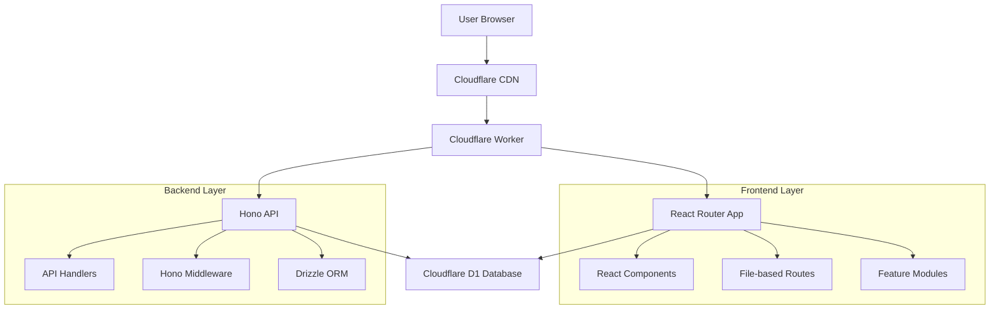

# Architecture Deep Dive

This document provides a comprehensive overview of the NARA boilerplate architecture, design patterns, and technical decisions.

---

## 🏗 Architecture Overview

The NARA boilerplate implements a **modern full-stack architecture** that emphasizes:

- **Type Safety** - End-to-end TypeScript coverage
- **Performance** - Edge deployment with SSR
- **Developer Experience** - Fast HMR, excellent tooling
- **Scalability** - Feature-based organization
- **Edge-First** - Cloudflare Workers runtime



---

## 🎯 Design Principles

### 1. **Type-Safe End-to-End**

Every layer of the application is typed:

```typescript
// Database Schema (Drizzle)
export const users = sqliteTable('users', {
  id: integer('id').primaryKey(),
  email: text('email').notNull(),
})

// API Handler (Hono)
app.get('/users/:id', async (c) => {
  const id = Number(c.req.param('id'))
  const user = await db.select().from(users).where(eq(users.id, id))
  return c.json(user) // TypeScript knows the shape
})

// Frontend (React Router)
export async function loader({ params }: LoaderFunctionArgs) {
  const response = await fetch(`/api/users/${params.id}`)
  return response.json() // Type-safe through API contract
}
```

### 2. **Feature-Based Organization**

Features are self-contained modules with their own:
- Components
- Business logic (utils)
- Type definitions
- Context/state management

```
/features/user-management/
  /components/
    user-list.tsx
    user-form.tsx
  /utils/
    user-validation.ts
    user-api.ts
  /types/
    user.types.ts
  /context/
    user-context.tsx
  page.tsx              # Main feature component
```

### 3. **Progressive Enhancement**

The application works without JavaScript and enhances with it:

```tsx
// Forms work without JS
<form method="post" action="/login">
  <input name="email" required />
  <button type="submit">Login</button>
</form>

// Enhanced with React
export async function action({ request }: ActionFunctionArgs) {
  const formData = await request.formData()
  const email = formData.get('email')
  // Handle login...
}
```

---

## 🧱 Layer Architecture

### **1. Presentation Layer (React)**

**Responsibilities:**
- User interface rendering
- User interaction handling
- Client-side state management
- Route-based code splitting

**Key Patterns:**

```tsx
// Component with data loading
export async function loader() {
  return { data: await fetchData() }
}

export default function Component() {
  const { data } = useLoaderData<typeof loader>()
  return <div>{data}</div>
}

// Component with mutations
export async function action({ request }: ActionFunctionArgs) {
  const formData = await request.formData()
  return redirect('/success')
}

export default function FormComponent() {
  return (
    <Form method="post">
      <input name="field" />
      <button type="submit">Submit</button>
    </Form>
  )
}
```

### **2. API Layer (Hono)**

**Responsibilities:**
- HTTP request handling
- Business logic orchestration
- Data validation
- Authentication/authorization

**Key Patterns:**

```tsx
// RESTful API design
const api = new Hono()

// Middleware
api.use('*', async (c, next) => {
  // Auth, logging, etc.
  await next()
})

// Route handlers
api.get('/users', async (c) => {
  const users = await db.select().from(usersTable)
  return c.json(users)
})

api.post('/users', async (c) => {
  const body = await c.req.json()
  const validatedData = userSchema.parse(body)
  const newUser = await db.insert(usersTable).values(validatedData)
  return c.json(newUser, 201)
})
```

### **3. Data Layer (Drizzle + D1)**

**Responsibilities:**
- Data persistence
- Query optimization
- Schema management
- Migration handling

**Key Patterns:**

```typescript
// Schema definition
export const users = sqliteTable('users', {
  id: integer('id').primaryKey(),
  email: text('email').notNull().unique(),
  createdAt: integer('created_at', { mode: 'timestamp' }).default(sql`CURRENT_TIMESTAMP`),
})

// Relations
export const posts = sqliteTable('posts', {
  id: integer('id').primaryKey(),
  userId: integer('user_id').references(() => users.id),
  title: text('title').notNull(),
})

export const usersRelations = relations(users, ({ many }) => ({
  posts: many(posts),
}))

// Queries
const usersWithPosts = await db.query.users.findMany({
  with: { posts: true }
})
```

---

## 🌊 Data Flow Patterns

### **Server-Side Rendering (SSR)**

1. **Request** → Cloudflare Worker
2. **Route Resolution** → React Router matches route
3. **Data Loading** → Loader functions fetch data
4. **Rendering** → React renders to HTML
5. **Hydration** → Client takes over

```tsx
// SSR-friendly data loading
export async function loader() {
  // Runs on server for SSR, client for navigation
  const data = await db.select().from(table)
  return { data }
}

export default function Page() {
  const { data } = useLoaderData<typeof loader>()
  // Renders on server and client
  return <div>{data}</div>
}
```

### **Client-Side Navigation**

1. **Link Click** → React Router intercepts
2. **Loader Execution** → Fetch new data
3. **Component Update** → React re-renders
4. **Optimistic Updates** → Immediate UI feedback

```tsx
// Optimistic UI patterns
export async function action({ request }: ActionFunctionArgs) {
  const formData = await request.formData()
  // Perform mutation
  return { success: true }
}

export default function OptimisticForm() {
  const actionData = useActionData<typeof action>()
  const navigation = useNavigation()
  
  const isSubmitting = navigation.state === 'submitting'
  
  return (
    <Form method="post">
      <button disabled={isSubmitting}>
        {isSubmitting ? 'Saving...' : 'Save'}
      </button>
    </Form>
  )
}
```

---

## 🧩 Component Architecture

### **Component Hierarchy**

```
App (root.tsx)
├── Layout Components
│   ├── Header
│   ├── Navigation  
│   └── Footer
├── Route Components
│   ├── Feature Pages
│   └── Shared Pages
└── UI Components (shadcn/ui)
    ├── Primitives (Button, Input)
    ├── Composites (Card, Form)
    └── Complex (DataTable, Charts)
```

### **Component Patterns**

**1. Container/Presentation Pattern**

```tsx
// Container (handles data/logic)
export async function loader() {
  const users = await fetchUsers()
  return { users }
}

export default function UsersPage() {
  const { users } = useLoaderData<typeof loader>()
  return <UserList users={users} />
}

// Presentation (pure UI)
interface UserListProps {
  users: User[]
}

export function UserList({ users }: UserListProps) {
  return (
    <div>
      {users.map(user => <UserCard key={user.id} user={user} />)}
    </div>
  )
}
```

**2. Compound Component Pattern**

```tsx
// Flexible, composable components
export function Card({ children, ...props }) {
  return <div className="card" {...props}>{children}</div>
}

Card.Header = function CardHeader({ children }) {
  return <div className="card-header">{children}</div>
}

Card.Content = function CardContent({ children }) {
  return <div className="card-content">{children}</div>
}

// Usage
<Card>
  <Card.Header>Title</Card.Header>
  <Card.Content>Content</Card.Content>
</Card>
```

**3. Render Props/Children as Function**

```tsx
// Flexible data sharing
function DataProvider({ children, query }) {
  const { data, loading, error } = useQuery(query)
  
  return children({ data, loading, error })
}

// Usage
<DataProvider query="users">
  {({ data, loading, error }) => (
    loading ? <Spinner /> : <UserList users={data} />
  )}
</DataProvider>
```

---

## 🔄 State Management Patterns

### **Server State (React Router)**

For data that originates from the server:

```tsx
// Automatic server state management
export async function loader() {
  return { users: await fetchUsers() }
}

export default function Component() {
  const { users } = useLoaderData<typeof loader>()
  // React Router handles caching, revalidation, etc.
}
```

### **Client State (React + Context)**

For UI state and client-specific data:

```tsx
// Feature-level context
interface UserContextType {
  selectedUser: User | null
  setSelectedUser: (user: User) => void
}

const UserContext = createContext<UserContextType>()

export function UserProvider({ children }) {
  const [selectedUser, setSelectedUser] = useState<User | null>(null)
  
  return (
    <UserContext.Provider value={{ selectedUser, setSelectedUser }}>
      {children}
    </UserContext.Provider>
  )
}

export const useUserContext = () => useContext(UserContext)
```

### **Form State (React Hook Form)**

For complex form handling:

```tsx
import { useForm } from 'react-hook-form'
import { zodResolver } from '@hookform/resolvers/zod'

const userSchema = z.object({
  email: z.string().email(),
  name: z.string().min(1),
})

export function UserForm() {
  const form = useForm({
    resolver: zodResolver(userSchema),
    defaultValues: { email: '', name: '' }
  })
  
  return (
    <Form {...form}>
      <form onSubmit={form.handleSubmit(onSubmit)}>
        <FormField name="email" />
        <FormField name="name" />
        <Button type="submit">Submit</Button>
      </form>
    </Form>
  )
}
```

---

## 🚀 Performance Optimizations

### **Code Splitting**

Routes are automatically code-split:

```tsx
// Each route is a separate bundle
export default function LazyRoute() {
  return <div>This route loads when needed</div>
}
```

### **Database Optimizations**

```typescript
// Efficient queries with Drizzle
const usersWithPostCount = await db
  .select({
    id: users.id,
    name: users.name,
    postCount: count(posts.id)
  })
  .from(users)
  .leftJoin(posts, eq(users.id, posts.userId))
  .groupBy(users.id)
```

### **Caching Strategies**

```tsx
// React Router handles route-level caching
export async function loader({ request }) {
  // Cache headers for edge caching
  return new Response(JSON.stringify(data), {
    headers: {
      'Cache-Control': 'public, max-age=300'
    }
  })
}
```

---

## 🔒 Security Considerations

### **Input Validation**

```typescript
// Validate all inputs with Zod
const createUserSchema = z.object({
  email: z.string().email().max(255),
  name: z.string().min(1).max(100),
})

export async function action({ request }: ActionFunctionArgs) {
  const formData = await request.formData()
  const result = createUserSchema.safeParse(Object.fromEntries(formData))
  
  if (!result.success) {
    return { errors: result.error.flatten() }
  }
  
  // Safe to use result.data
}
```

### **SQL Injection Prevention**

```typescript
// Drizzle prevents SQL injection
await db.select().from(users).where(eq(users.id, userId)) // Safe
// Never do: sql`SELECT * FROM users WHERE id = ${userId}` // Unsafe
```

### **Content Security Policy**

```typescript
// Set CSP headers in worker
export async function onRequest({ request, next }) {
  const response = await next()
  response.headers.set('Content-Security-Policy', 'default-src \'self\'')
  return response
}
```

---

## 📈 Scalability Patterns

### **Feature Modularity**

- Features can be developed independently
- Clear boundaries between modules
- Shared components in `/app/components/ui/`

### **Database Schema Evolution**

```typescript
// Versioned migrations
// drizzle/0001_add_users_table.sql
// drizzle/0002_add_posts_table.sql
// drizzle/0003_add_user_posts_relation.sql
```

### **API Versioning**

```typescript
// Version API routes
app.route('/api/v1', v1Routes)
app.route('/api/v2', v2Routes)
```

---

## 🧪 Testing Architecture

### **Unit Tests**

```typescript
// Component testing
import { render, screen } from '@testing-library/react'
import { UserCard } from './user-card'

test('displays user information', () => {
  const user = { id: 1, name: 'John', email: 'john@example.com' }
  render(<UserCard user={user} />)
  
  expect(screen.getByText('John')).toBeInTheDocument()
  expect(screen.getByText('john@example.com')).toBeInTheDocument()
})
```

### **Integration Tests**

```typescript
// API testing with Cloudflare Workers
import { SELF } from 'cloudflare:test'

test('GET /api/users returns users list', async () => {
  const response = await SELF.fetch('/api/users')
  const users = await response.json()
  
  expect(response.status).toBe(200)
  expect(Array.isArray(users)).toBe(true)
})
```

---

## 🔧 Development Tools Integration

### **TypeScript Integration**

- Strict mode enabled
- Path mapping configured
- Automatic type generation for routes

### **Build Process**

1. **TypeScript Compilation** → Type checking
2. **React Router Build** → Route generation + bundling
3. **Wrangler Deploy** → Worker deployment

### **Development Server**

- **Vite** for frontend HMR
- **Wrangler** for worker simulation
- **React Router** for SSR development

---

This architecture provides a solid foundation for building scalable, maintainable full-stack React applications with modern tooling and best practices.

---

Built with ❤️ by KotonoSora — to help you ship faster and with confidence.