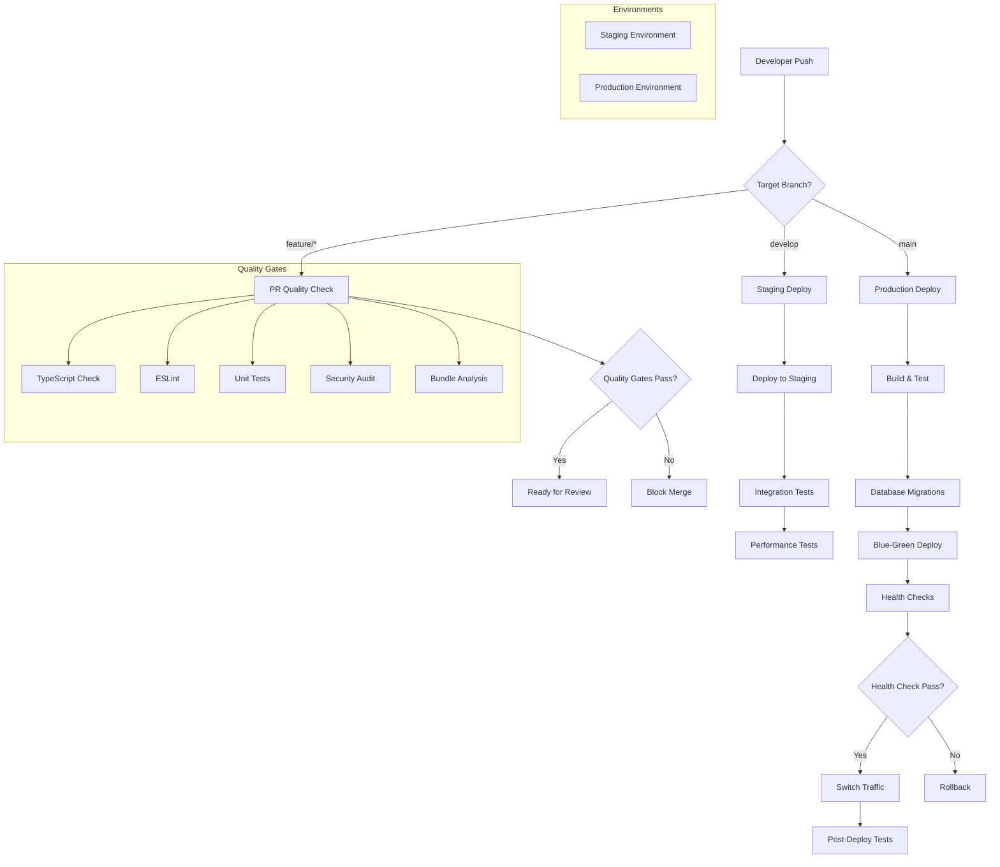

# CI/CD Deployment Guide for NARA Boilerplate

This comprehensive guide covers the complete CI/CD pipeline for testing, building, and deploying the NARA full-stack React application to Cloudflare's edge infrastructure.

## 📋 Table of Contents

- [📂 Workflows Overview](#-workflows-overview)
- [🏗 CI/CD Architecture](#-cicd-architecture)
- [🔐 Security & Secrets Management](#-security--secrets-management)
- [🌐 Multi-Environment Deployment](#-multi-environment-deployment)
- [🚀 Advanced Deployment Strategies](#-advanced-deployment-strategies)
- [📊 Monitoring & Health Checks](#-monitoring--health-checks)
- [🔄 Rollback Strategies](#-rollback-strategies)
- [🧪 Testing in CI/CD](#-testing-in-cicd)
- [🐛 Troubleshooting & Debugging](#-troubleshooting--debugging)
- [⚡ Performance Optimization](#-performance-optimization)
- [📚 Best Practices](#-best-practices)

---

## 📂 Workflows Overview

### 1. `ci-pr-check.yml` — Pull Request Quality Gates

**Trigger**: On `pull_request` targeting `main`, `develop`, or `release/**` branches.

**Quality Gates**:

```yaml
name: PR Quality Check
on:
  pull_request:
    branches: [main, develop, 'release/**']
    paths-ignore:
      - '**.md'
      - 'docs/**'

jobs:
  quality-check:
    runs-on: ubuntu-latest
    steps:
      - name: Checkout code
        uses: actions/checkout@v4
        
      - name: Setup Bun
        uses: oven-sh/setup-bun@v1
        with:
          bun-version: 1.2.19
          
      - name: Cache dependencies
        uses: actions/cache@v4
        with:
          path: ~/.bun/install/cache
          key: ${{ runner.os }}-bun-${{ hashFiles('bun.lock') }}
          restore-keys: ${{ runner.os }}-bun-
          
      - name: Install dependencies
        run: bun install --frozen-lockfile
        
      - name: Type checking
        run: bun run typecheck
        
      - name: Lint code
        run: bun run lint
        
      - name: Run unit tests
        run: bun run test:unit --coverage
        
      - name: Upload coverage reports
        uses: codecov/codecov-action@v4
        with:
          file: ./coverage/coverage-final.json
          
      - name: Security audit
        run: bun audit
        
      - name: Check bundle size
        run: bun run build:analyze
```

**Quality Metrics**:

- ✅ TypeScript compilation passes
- ✅ ESLint rules pass with zero warnings
- ✅ Unit test coverage > 80%
- ✅ No known security vulnerabilities
- ✅ Bundle size within limits

---

### 2. `ci-main-deploy.yml` — Automated Main Branch Deployment

**Trigger**: On push to `main` branch (production deployment).

**Deployment Pipeline**:

```yaml
name: Production Deployment
on:
  push:
    branches: [main]
    paths-ignore:
      - '**.md'
      - 'docs/**'

jobs:
  deploy-production:
    runs-on: ubuntu-latest
    environment: production
    steps:
      - name: Checkout code
        uses: actions/checkout@v4
        
      - name: Setup Bun
        uses: oven-sh/setup-bun@v1
        with:
          bun-version: 1.2.19
          
      - name: Install dependencies
        run: bun install --frozen-lockfile
        
      - name: Run full test suite
        run: |
          bun run test:unit
          bun run test:integration
          bun run test:e2e
          
      - name: Build application
        run: bun run build
        env:
          NODE_ENV: production
          
      - name: Configure Cloudflare
        run: |
          echo "[[d1_databases]]" >> wrangler.toml
          echo "binding = \"DB\"" >> wrangler.toml
          echo "database_name = \"${{ secrets.D1_DATABASE_NAME }}\"" >> wrangler.toml
          echo "database_id = \"${{ secrets.D1_DATABASE_ID }}\"" >> wrangler.toml
          
      - name: Run database migrations
        run: bun run db:migrate-production
        env:
          CLOUDFLARE_API_TOKEN: ${{ secrets.CLOUDFLARE_API_TOKEN }}
          CLOUDFLARE_ACCOUNT_ID: ${{ secrets.CLOUDFLARE_ACCOUNT_ID }}
          
      - name: Deploy to Cloudflare
        run: bun run deploy
        env:
          CLOUDFLARE_API_TOKEN: ${{ secrets.CLOUDFLARE_API_TOKEN }}
          CLOUDFLARE_ACCOUNT_ID: ${{ secrets.CLOUDFLARE_ACCOUNT_ID }}
          
      - name: Run post-deployment tests
        run: bun run test:smoke-production
        env:
          TEST_URL: https://your-app.pages.dev
          
      - name: Notify team
        if: always()
        uses: 8398a7/action-slack@v3
        with:
          status: ${{ job.status }}
          webhook_url: ${{ secrets.SLACK_WEBHOOK }}
```

---

### 3. `ci-staging-deploy.yml` — Staging Environment Deployment

**Trigger**: On push to `develop` branch or manual trigger.

**Features**:

- Preview deployments for testing
- Database seeding with test data
- Integration test execution
- Performance benchmarking

```yaml
name: Staging Deployment
on:
  push:
    branches: [develop]
  workflow_dispatch:
    inputs:
      run_performance_tests:
        description: 'Run performance tests'
        required: false
        default: 'false'
        type: boolean

jobs:
  deploy-staging:
    runs-on: ubuntu-latest
    environment: staging
    steps:
      - name: Checkout code
        uses: actions/checkout@v4
        
      - name: Deploy to staging
        run: bun run deploy:staging
        
      - name: Seed test data
        run: bun run db:seed-staging
        
      - name: Run integration tests
        run: bun run test:integration:staging
        
      - name: Performance tests
        if: ${{ github.event.inputs.run_performance_tests == 'true' }}
        run: bun run test:performance
```

---

### 4. `manual-deploy-cloudflare.yml` — Manual Deployment Control

**Enhanced Manual Deployment**:

```yaml
name: Manual Deployment
on:
  workflow_dispatch:
    inputs:
      environment:
        description: 'Deployment environment'
        required: true
        default: 'staging'
        type: choice
        options:
        - staging
        - production
      branch:
        description: 'Branch to deploy'
        required: true
        default: 'main'
        type: string
      run_migrations:
        description: 'Run database migrations'
        required: false
        default: true
        type: boolean
      skip_tests:
        description: 'Skip test execution (emergency only)'
        required: false
        default: false
        type: boolean

jobs:
  manual-deploy:
    runs-on: ubuntu-latest
    environment: ${{ github.event.inputs.environment }}
    steps:
      - name: Validate deployment
        run: |
          if [[ "${{ github.event.inputs.environment }}" == "production" && "${{ github.actor }}" != "admin-user" ]]; then
            echo "Only admins can deploy to production"
            exit 1
          fi
          
      - name: Deploy with safety checks
        run: |
          echo "Deploying ${{ github.event.inputs.branch }} to ${{ github.event.inputs.environment }}"
          # Deployment logic here
```

---

## 🏗 CI/CD Architecture

### **Pipeline Architecture Overview**



### **Deployment Environments**

| Environment | Purpose | Trigger | Database | Domain |
|-------------|---------|---------|----------|---------|
| **Development** | Local development | Manual | Local SQLite | localhost:5173 |
| **Preview** | PR previews | PR creation | Staging D1 | pr-123.pages.dev |
| **Staging** | Integration testing | Push to develop | Staging D1 | staging.app.dev |
| **Production** | Live application | Push to main | Production D1 | app.com |

### **Environment-Specific Configurations**

```yaml
# .github/environments/staging.yml
environment:
  name: staging
  url: https://staging.your-app.pages.dev
  protection_rules:
    required_reviewers: 1
    prevent_self_review: true
  variables:
    NODE_ENV: staging
    LOG_LEVEL: debug
    CACHE_TTL: 60
  secrets:
    CLOUDFLARE_API_TOKEN: ${{ secrets.STAGING_CLOUDFLARE_API_TOKEN }}
    DATABASE_ID: ${{ secrets.STAGING_D1_DATABASE_ID }}

# .github/environments/production.yml
environment:
  name: production
  url: https://your-app.pages.dev
  protection_rules:
    required_reviewers: 2
    prevent_self_review: true
    required_status_checks:
      - ci-pr-check
      - security-scan
  variables:
    NODE_ENV: production
    LOG_LEVEL: warn
    CACHE_TTL: 300
  secrets:
    CLOUDFLARE_API_TOKEN: ${{ secrets.PRODUCTION_CLOUDFLARE_API_TOKEN }}
    DATABASE_ID: ${{ secrets.PRODUCTION_D1_DATABASE_ID }}
```

---

## 🔐 Security & Secrets Management

### **Enhanced Secrets Configuration**

| Secret | Description | Environment | Rotation |
|--------|-------------|-------------|----------|
| `CLOUDFLARE_API_TOKEN` | API token with minimal permissions | All | 90 days |
| `CLOUDFLARE_ACCOUNT_ID` | Account identifier | All | Static |
| `D1_DATABASE_ID` | Database identifier | Per environment | Static |
| `D1_DATABASE_NAME` | Database name | Per environment | Static |
| `ENCRYPTION_KEY` | Application encryption key | All | 30 days |
| `JWT_SECRET` | JWT signing secret | All | 30 days |
| `SLACK_WEBHOOK` | Notification webhook | All | As needed |
| `SENTRY_DSN` | Error tracking DSN | All | As needed |

### **Security Best Practices**

```yaml
# Security-focused workflow example
name: Security Scan
on:
  schedule:
    - cron: '0 2 * * *'  # Daily at 2 AM
  pull_request:
    branches: [main]

jobs:
  security-scan:
    runs-on: ubuntu-latest
    steps:
      - name: Checkout code
        uses: actions/checkout@v4
        
      - name: Run Trivy vulnerability scanner
        uses: aquasecurity/trivy-action@master
        with:
          scan-type: 'fs'
          scan-ref: '.'
          format: 'sarif'
          output: 'trivy-results.sarif'
          
      - name: Upload Trivy scan results
        uses: github/codeql-action/upload-sarif@v2
        with:
          sarif_file: 'trivy-results.sarif'
          
      - name: Dependency vulnerability check
        run: bun audit --audit-level moderate
        
      - name: SAST scan with CodeQL
        uses: github/codeql-action/analyze@v2
        with:
          languages: typescript,javascript
          
      - name: Check for secrets
        uses: trufflesecurity/trufflehog@main
        with:
          path: ./
          base: main
          head: HEAD
```

### **API Token Permissions (Cloudflare)**

**Minimum Required Permissions**:

- Assign permissions:
  - Account → D1 → Edit
  - Account → Cloudflare Pages → Edit
  - Account → Workers Scripts → Edit
  
#### 🔐 Cloudflare Setup (Cloudflare Dashboard → My Profile → API Tokens)

In a non-interactive environment, it's necessary to set a `CLOUDFLARE_API_TOKEN` environment variable for wrangler to work. Refer to the [guide](https://developers.cloudflare.com/fundamentals/api/get-started/create-token/) for instructions on how to create an API token, and assign its value to `CLOUDFLARE_API_TOKEN`

- Click Create Token → Use the Edit Cloudflare Workers template.
- Click edit Token name
- Assign permissions:
  - Account → D1 → Edit
  - Account → Cloudflare Pages → Edit
  - Account → Workers Scripts → Edit
- Assign Account Resources
- Define how long this token will stay active
- Copy the API token

---

## 🌐 Multi-Environment Deployment

### **Environment Promotion Strategy**

```yaml
# .github/workflows/environment-promotion.yml
name: Environment Promotion
on:
  workflow_dispatch:
    inputs:
      from_environment:
        description: 'Source environment'
        required: true
        type: choice
        options: [staging, production]
      to_environment:
        description: 'Target environment'
        required: true
        type: choice
        options: [staging, production]
      version:
        description: 'Version to promote'
        required: true
        type: string

jobs:
  promote:
    runs-on: ubuntu-latest
    steps:
      - name: Validate promotion
        run: |
          # Validate promotion rules
          if [[ "${{ inputs.from_environment }}" == "production" && "${{ inputs.to_environment }}" == "staging" ]]; then
            echo "Cannot promote from production to staging"
            exit 1
          fi
          
      - name: Promote version
        run: |
          wrangler versions deploy ${{ inputs.version }} \
            --env ${{ inputs.to_environment }} \
            --message "Promoted from ${{ inputs.from_environment }}"
```

### **Database Migration Strategy**

```yaml
# Database migration workflow
name: Database Migration
on:
  workflow_dispatch:
    inputs:
      environment:
        required: true
        type: choice
        options: [staging, production]
      migration_type:
        required: true
        type: choice
        options: [forward, rollback]
      target_migration:
        description: 'Target migration (for rollback)'
        required: false
        type: string

jobs:
  migrate:
    runs-on: ubuntu-latest
    environment: ${{ inputs.environment }}
    steps:
      - name: Backup database
        if: ${{ inputs.environment == 'production' }}
        run: |
          # Create backup before migration
          wrangler d1 backup create ${{ secrets.D1_DATABASE_NAME }} \
            --name "pre-migration-$(date +%Y%m%d%H%M%S)"
            
      - name: Run migration
        run: |
          if [[ "${{ inputs.migration_type }}" == "forward" ]]; then
            bun run db:migrate
          else
            bun run db:rollback ${{ inputs.target_migration }}
          fi
          
      - name: Verify migration
        run: bun run db:verify
        
      - name: Notify team
        if: failure()
        run: |
          curl -X POST ${{ secrets.SLACK_WEBHOOK }} \
            -d '{"text":"🚨 Database migration failed in ${{ inputs.environment }}!"}'
```

---

## 🚀 Advanced Deployment Strategies

### **Blue-Green Deployment**

```yaml
name: Blue-Green Deployment
on:
  push:
    branches: [main]

jobs:
  blue-green-deploy:
    runs-on: ubuntu-latest
    steps:
      - name: Deploy to inactive slot
        run: |
          # Deploy to blue/green slot
          ACTIVE_SLOT=$(wrangler versions list --json | jq -r '.[] | select(.percentage == 100) | .id')
          NEW_SLOT=$(wrangler versions upload --json | jq -r '.id')
          
          echo "ACTIVE_SLOT=$ACTIVE_SLOT" >> $GITHUB_ENV
          echo "NEW_SLOT=$NEW_SLOT" >> $GITHUB_ENV
          
      - name: Health check new deployment
        run: |
          # Wait for deployment to be ready
          sleep 30
          
          # Run health checks
          HEALTH_URL="https://${{ env.NEW_SLOT }}--your-app.pages.dev/api/health"
          
          for i in {1..10}; do
            if curl -f "$HEALTH_URL"; then
              echo "Health check passed"
              break
            fi
            
            if [ $i -eq 10 ]; then
              echo "Health check failed after 10 attempts"
              exit 1
            fi
            
            sleep 10
          done
          
      - name: Gradual traffic switch
        run: |
          # Switch traffic gradually
          for percentage in 10 25 50 75 100; do
            wrangler versions deploy ${{ env.NEW_SLOT }} \
              --percentage $percentage
              
            echo "Switched $percentage% traffic to new version"
            
            # Monitor for 2 minutes
            sleep 120
            
            # Check error rates
            ERROR_RATE=$(curl -s "https://api.cloudflare.com/client/v4/accounts/${{ secrets.CLOUDFLARE_ACCOUNT_ID }}/analytics" | jq '.result.error_rate')
            
            if (( $(echo "$ERROR_RATE > 0.01" | bc -l) )); then
              echo "Error rate too high: $ERROR_RATE"
              wrangler versions deploy ${{ env.ACTIVE_SLOT }} --percentage 100
              exit 1
            fi
          done
          
      - name: Complete deployment
        run: |
          echo "Blue-green deployment completed successfully"
          wrangler versions delete ${{ env.ACTIVE_SLOT }}
```

### **Canary Deployment**

```yaml
name: Canary Deployment
on:
  workflow_dispatch:
    inputs:
      canary_percentage:
        description: 'Canary traffic percentage'
        required: true
        default: '10'
        type: choice
        options: ['5', '10', '25', '50']

jobs:
  canary-deploy:
    runs-on: ubuntu-latest
    steps:
      - name: Deploy canary version
        run: |
          CANARY_VERSION=$(wrangler versions upload --json | jq -r '.id')
          
          wrangler versions deploy $CANARY_VERSION \
            --percentage ${{ inputs.canary_percentage }}
            
          echo "CANARY_VERSION=$CANARY_VERSION" >> $GITHUB_ENV
          
      - name: Monitor canary
        run: |
          # Monitor canary for 30 minutes
          for i in {1..30}; do
            # Get metrics for canary version
            METRICS=$(curl -s "https://api.cloudflare.com/client/v4/accounts/${{ secrets.CLOUDFLARE_ACCOUNT_ID }}/analytics/canary/${{ env.CANARY_VERSION }}")
            
            ERROR_RATE=$(echo $METRICS | jq '.result.error_rate')
            RESPONSE_TIME=$(echo $METRICS | jq '.result.avg_response_time')
            
            echo "Minute $i: Error rate: $ERROR_RATE, Response time: ${RESPONSE_TIME}ms"
            
            # Check thresholds
            if (( $(echo "$ERROR_RATE > 0.005" | bc -l) )); then
              echo "Canary failed: error rate too high"
              wrangler versions deploy --percentage 0 ${{ env.CANARY_VERSION }}
              exit 1
            fi
            
            if (( $(echo "$RESPONSE_TIME > 1000" | bc -l) )); then
              echo "Canary failed: response time too high"
              wrangler versions deploy --percentage 0 ${{ env.CANARY_VERSION }}
              exit 1
            fi
            
            sleep 60
          done
          
      - name: Promote canary
        run: |
          echo "Canary monitoring successful, promoting to 100%"
          wrangler versions deploy ${{ env.CANARY_VERSION }} --percentage 100
```

---

## 📊 Monitoring & Health Checks

### **Comprehensive Health Check System**

```yaml
# Health check workflow
name: Health Check Monitoring
on:
  schedule:
    - cron: '*/5 * * * *'  # Every 5 minutes
  workflow_dispatch:

jobs:
  health-check:
    runs-on: ubuntu-latest
    strategy:
      matrix:
        environment: [staging, production]
    steps:
      - name: Basic health check
        run: |
          HEALTH_URL="https://${{ matrix.environment == 'production' && 'your-app.pages.dev' || 'staging.your-app.pages.dev' }}/api/health"
          
          RESPONSE=$(curl -s -w "%{http_code}" -o /tmp/health_response "$HEALTH_URL")
          
          if [ "$RESPONSE" != "200" ]; then
            echo "Health check failed with status: $RESPONSE"
            exit 1
          fi
          
          # Check response content
          if ! grep -q '"status":"healthy"' /tmp/health_response; then
            echo "Health check response indicates unhealthy state"
            cat /tmp/health_response
            exit 1
          fi
          
      - name: Database connectivity check
        run: |
          DB_HEALTH_URL="https://${{ matrix.environment == 'production' && 'your-app.pages.dev' || 'staging.your-app.pages.dev' }}/api/health/database"
          
          if ! curl -f "$DB_HEALTH_URL"; then
            echo "Database health check failed"
            exit 1
          fi
          
      - name: API endpoints check
        run: |
          BASE_URL="https://${{ matrix.environment == 'production' && 'your-app.pages.dev' || 'staging.your-app.pages.dev' }}"
          
          # Test critical endpoints
          endpoints=(
            "/api/health"
            "/api/version"
            "/api/posts"
          )
          
          for endpoint in "${endpoints[@]}"; do
            echo "Testing $endpoint"
            if ! curl -f "$BASE_URL$endpoint"; then
              echo "Endpoint $endpoint failed"
              exit 1
            fi
          done
          
      - name: Performance check
        run: |
          # Check response times
          PERF_URL="https://${{ matrix.environment == 'production' && 'your-app.pages.dev' || 'staging.your-app.pages.dev' }}"
          
          RESPONSE_TIME=$(curl -w "%{time_total}" -s -o /dev/null "$PERF_URL")
          RESPONSE_TIME_MS=$(echo "$RESPONSE_TIME * 1000" | bc)
          
          echo "Response time: ${RESPONSE_TIME_MS}ms"
          
          # Alert if response time > 2 seconds
          if (( $(echo "$RESPONSE_TIME > 2" | bc -l) )); then
            echo "Response time too slow: ${RESPONSE_TIME_MS}ms"
            # Send alert but don't fail
          fi
          
      - name: Alert on failure
        if: failure()
        run: |
          curl -X POST ${{ secrets.SLACK_WEBHOOK }} \
            -H 'Content-type: application/json' \
            -d '{
              "text": "🚨 Health check failed for ${{ matrix.environment }}",
              "attachments": [
                {
                  "color": "danger",
                  "fields": [
                    {
                      "title": "Environment",
                      "value": "${{ matrix.environment }}",
                      "short": true
                    },
                    {
                      "title": "Workflow",
                      "value": "${{ github.workflow }}",
                      "short": true
                    },
                    {
                      "title": "Run URL",
                      "value": "${{ github.server_url }}/${{ github.repository }}/actions/runs/${{ github.run_id }}",
                      "short": false
                    }
                  ]
                }
              ]
            }'
```

### **Performance Monitoring Integration**

```yaml
# Performance monitoring
name: Performance Monitoring
on:
  schedule:
    - cron: '0 */6 * * *'  # Every 6 hours
  workflow_dispatch:

jobs:
  lighthouse-audit:
    runs-on: ubuntu-latest
    steps:
      - name: Run Lighthouse audit
        uses: treosh/lighthouse-ci-action@v10
        with:
          urls: |
            https://your-app.pages.dev
            https://your-app.pages.dev/posts
          configPath: './.lighthouserc.json'
          uploadArtifacts: true
          temporaryPublicStorage: true
          
      - name: Core Web Vitals check
        run: |
          # Check Core Web Vitals metrics
          npm install -g lighthouse
          
          REPORT=$(lighthouse https://your-app.pages.dev --output json --quiet)
          
          LCP=$(echo $REPORT | jq '.audits["largest-contentful-paint"].numericValue')
          FID=$(echo $REPORT | jq '.audits["max-potential-fid"].numericValue')
          CLS=$(echo $REPORT | jq '.audits["cumulative-layout-shift"].numericValue')
          
          echo "LCP: ${LCP}ms, FID: ${FID}ms, CLS: $CLS"
          
          # Alert if metrics exceed thresholds
          if (( $(echo "$LCP > 2500" | bc -l) )); then
            echo "LCP too high: ${LCP}ms"
          fi
```

---

## 🔄 Rollback Strategies

### **Automated Rollback System**

```yaml
name: Automated Rollback
on:
  workflow_dispatch:
    inputs:
      environment:
        required: true
        type: choice
        options: [staging, production]
      rollback_type:
        required: true
        type: choice
        options: [previous_version, specific_version, database_only]
      target_version:
        description: 'Specific version to rollback to'
        required: false
        type: string
      reason:
        description: 'Rollback reason'
        required: true
        type: string

jobs:
  rollback:
    runs-on: ubuntu-latest
    environment: ${{ inputs.environment }}
    steps:
      - name: Validate rollback request
        run: |
          if [[ "${{ inputs.environment }}" == "production" ]]; then
            # Require approval for production rollbacks
            echo "Production rollback requires manual approval"
          fi
          
      - name: Get current version
        run: |
          CURRENT_VERSION=$(wrangler versions list --json | jq -r '.[] | select(.percentage == 100) | .id')
          echo "CURRENT_VERSION=$CURRENT_VERSION" >> $GITHUB_ENV
          echo "Current version: $CURRENT_VERSION"
          
      - name: Determine rollback target
        run: |
          if [[ "${{ inputs.rollback_type }}" == "previous_version" ]]; then
            TARGET_VERSION=$(wrangler versions list --json | jq -r '.[] | select(.id != "${{ env.CURRENT_VERSION }}") | .id' | head -1)
          elif [[ "${{ inputs.rollback_type }}" == "specific_version" ]]; then
            TARGET_VERSION="${{ inputs.target_version }}"
          fi
          
          echo "TARGET_VERSION=$TARGET_VERSION" >> $GITHUB_ENV
          echo "Rolling back to: $TARGET_VERSION"
          
      - name: Create rollback backup
        if: ${{ inputs.environment == 'production' }}
        run: |
          # Backup current state before rollback
          wrangler d1 backup create ${{ secrets.D1_DATABASE_NAME }} \
            --name "pre-rollback-$(date +%Y%m%d%H%M%S)"
            
      - name: Execute application rollback
        if: ${{ inputs.rollback_type != 'database_only' }}
        run: |
          # Switch traffic to previous version
          wrangler versions deploy ${{ env.TARGET_VERSION }} --percentage 100
          
          echo "Application rolled back to version: ${{ env.TARGET_VERSION }}"
          
      - name: Execute database rollback
        if: ${{ inputs.rollback_type == 'database_only' || inputs.rollback_type == 'specific_version' }}
        run: |
          # Database rollback logic
          echo "Rolling back database..."
          # This would depend on your migration strategy
          
      - name: Verify rollback
        run: |
          # Health check after rollback
          sleep 30
          
          HEALTH_URL="https://${{ inputs.environment == 'production' && 'your-app.pages.dev' || 'staging.your-app.pages.dev' }}/api/health"
          
          for i in {1..5}; do
            if curl -f "$HEALTH_URL"; then
              echo "Rollback verification successful"
              break
            fi
            
            if [ $i -eq 5 ]; then
              echo "Rollback verification failed"
              exit 1
            fi
            
            sleep 10
          done
          
      - name: Document rollback
        run: |
          # Create rollback documentation
          cat << EOF > rollback-report.md
          # Rollback Report
          
          **Date**: $(date)
          **Environment**: ${{ inputs.environment }}
          **Previous Version**: ${{ env.CURRENT_VERSION }}
          **Rolled Back To**: ${{ env.TARGET_VERSION }}
          **Reason**: ${{ inputs.reason }}
          **Executed By**: ${{ github.actor }}
          
          ## Verification
          - [ ] Application health check passed
          - [ ] Database integrity verified
          - [ ] Critical functionality tested
          EOF
          
      - name: Notify team
        run: |
          curl -X POST ${{ secrets.SLACK_WEBHOOK }} \
            -H 'Content-type: application/json' \
            -d '{
              "text": "🔄 Rollback executed for ${{ inputs.environment }}",
              "attachments": [
                {
                  "color": "warning",
                  "fields": [
                    {
                      "title": "Environment",
                      "value": "${{ inputs.environment }}",
                      "short": true
                    },
                    {
                      "title": "Version",
                      "value": "${{ env.TARGET_VERSION }}",
                      "short": true
                    },
                    {
                      "title": "Reason",
                      "value": "${{ inputs.reason }}",
                      "short": false
                    }
                  ]
                }
              ]
            }'
```

---

## 🧪 Testing in CI/CD

### **Comprehensive Testing Strategy**

```yaml
name: Comprehensive Testing
on:
  pull_request:
    branches: [main, develop]
  push:
    branches: [main, develop]

jobs:
  unit-tests:
    runs-on: ubuntu-latest
    steps:
      - name: Run unit tests
        run: |
          bun run test:unit --coverage --reporter=verbose
          
      - name: Upload coverage
        uses: codecov/codecov-action@v4
        with:
          files: ./coverage/lcov.info
          flags: unit-tests
          
  integration-tests:
    runs-on: ubuntu-latest
    needs: unit-tests
    steps:
      - name: Setup test database
        run: |
          # Create isolated test database
          bun run db:setup-test
          
      - name: Run integration tests
        run: |
          bun run test:integration --reporter=verbose
          
      - name: Cleanup test database
        if: always()
        run: |
          bun run db:cleanup-test
          
  e2e-tests:
    runs-on: ubuntu-latest
    needs: [unit-tests, integration-tests]
    steps:
      - name: Start test server
        run: |
          bun run dev &
          sleep 10  # Wait for server to start
          
      - name: Run E2E tests
        run: |
          bun run test:e2e --headed=false
          
      - name: Upload E2E artifacts
        if: failure()
        uses: actions/upload-artifact@v4
        with:
          name: e2e-screenshots
          path: tests/e2e/screenshots/
          
  performance-tests:
    runs-on: ubuntu-latest
    if: github.event_name == 'push' && github.ref == 'refs/heads/main'
    steps:
      - name: Run performance tests
        run: |
          bun run test:performance
          
      - name: Performance regression check
        run: |
          # Compare with baseline metrics
          CURRENT_SCORE=$(cat performance-results.json | jq '.score')
          BASELINE_SCORE=85  # Minimum acceptable score
          
          if (( $(echo "$CURRENT_SCORE < $BASELINE_SCORE" | bc -l) )); then
            echo "Performance regression detected: $CURRENT_SCORE < $BASELINE_SCORE"
            exit 1
          fi
          
  security-tests:
    runs-on: ubuntu-latest
    steps:
      - name: SAST scan
        uses: github/codeql-action/analyze@v2
        with:
          languages: typescript,javascript
          
      - name: Dependency vulnerability scan
        run: |
          bun audit --audit-level moderate
          
      - name: Container security scan
        uses: aquasecurity/trivy-action@master
        with:
          scan-type: 'fs'
          scan-ref: '.'
```

---

## 🐛 Troubleshooting & Debugging

### **Common CI/CD Issues and Solutions**

#### **1. Build Failures**

```yaml
# Debug build issues
- name: Debug build failure
  if: failure()
  run: |
    echo "Build failed. Collecting debug information..."
    
    # Check disk space
    df -h
    
    # Check memory usage
    free -m
    
    # Check environment variables
    env | grep -E "(NODE_|BUN_|CLOUDFLARE_)" | sort
    
    # Check dependencies
    bun --version
    node --version
    
    # Verbose build
    bun run build --verbose
```

#### **2. Deployment Failures**

```yaml
# Debug deployment issues
- name: Debug deployment failure
  if: failure()
  run: |
    echo "Deployment failed. Checking Cloudflare status..."
    
    # Check Wrangler configuration
    wrangler whoami
    wrangler kv:namespace list
    
    # Check D1 database
    wrangler d1 list
    
    # Validate wrangler.toml
    wrangler config validate
    
    # Check latest logs
    wrangler tail --format pretty
```

#### **3. Database Migration Issues**

```yaml
# Debug migration problems
- name: Debug migration failure
  if: failure()
  run: |
    echo "Migration failed. Checking database state..."
    
    # Check migration status
    bun run db:status
    
    # Check database schema
    wrangler d1 execute ${{ secrets.D1_DATABASE_NAME }} \
      --command "SELECT name FROM sqlite_master WHERE type='table';"
    
    # Check for lock tables
    wrangler d1 execute ${{ secrets.D1_DATABASE_NAME }} \
      --command "SELECT * FROM drizzle.__drizzle_migrations;"
```

### **Debugging Workflows**

```yaml
name: Debug Workflow
on:
  workflow_dispatch:
    inputs:
      debug_level:
        description: 'Debug level'
        required: true
        type: choice
        options: [basic, detailed, verbose]
      component:
        description: 'Component to debug'
        required: true
        type: choice
        options: [build, deploy, database, networking]

jobs:
  debug:
    runs-on: ubuntu-latest
    steps:
      - name: Enable debug logging
        run: |
          if [[ "${{ inputs.debug_level }}" == "verbose" ]]; then
            echo "ACTIONS_STEP_DEBUG=true" >> $GITHUB_ENV
            echo "ACTIONS_RUNNER_DEBUG=true" >> $GITHUB_ENV
          fi
          
      - name: Debug build system
        if: ${{ inputs.component == 'build' }}
        run: |
          echo "=== Build System Debug ==="
          bun --version
          node --version
          npm --version
          
          echo "=== Environment ==="
          env | sort
          
          echo "=== Package.json ==="
          cat package.json
          
          echo "=== Dependencies ==="
          bun list
          
      - name: Debug deployment
        if: ${{ inputs.component == 'deploy' }}
        run: |
          echo "=== Deployment Debug ==="
          wrangler --version
          wrangler whoami
          
          echo "=== Configuration ==="
          cat wrangler.toml
          
          echo "=== Account Info ==="
          wrangler account list
          
      - name: Debug database
        if: ${{ inputs.component == 'database' }}
        run: |
          echo "=== Database Debug ==="
          
          echo "=== D1 Databases ==="
          wrangler d1 list
          
          echo "=== Migration Status ==="
          bun run db:status
          
          echo "=== Schema ==="
          cat database/schema.ts
          
      - name: Debug networking
        if: ${{ inputs.component == 'networking' }}
        run: |
          echo "=== Network Debug ==="
          
          # Test DNS resolution
          nslookup your-app.pages.dev
          
          # Test connectivity
          curl -I https://api.cloudflare.com/client/v4/user
          
          # Test API endpoints
          curl -v https://your-app.pages.dev/api/health
```

---

## ⚡ Performance Optimization

### **Build Performance**

```yaml
# Optimized build configuration
- name: Optimize build performance
  run: |
    # Enable build caching
    export BUN_CACHE_DIR=$HOME/.bun/cache
    
    # Parallel builds
    export BUN_JOBS=$(nproc)
    
    # Build with optimizations
    bun run build --production --minify
```

### **Deployment Performance**

```yaml
# Fast deployment strategies
- name: Optimized deployment
  run: |
    # Use deployment slots for faster switches
    SLOT_ID=$(wrangler versions upload --compatibility-date=2024-01-01)
    
    # Pre-warm the deployment
    curl "https://$SLOT_ID--your-app.pages.dev/api/health"
    
    # Quick traffic switch
    wrangler versions deploy $SLOT_ID --percentage 100
```

### **CI Pipeline Performance**

```yaml
# Pipeline optimization
jobs:
  build:
    runs-on: ubuntu-latest
    steps:
      - name: Optimize pipeline
        run: |
          # Parallel job execution
          echo "Enabling job parallelization"
          
      - name: Cache optimization
        uses: actions/cache@v4
        with:
          path: |
            ~/.bun/install/cache
            node_modules
            .next/cache
          key: ${{ runner.os }}-deps-${{ hashFiles('bun.lock') }}
          restore-keys: |
            ${{ runner.os }}-deps-
```

---

## 📚 Best Practices

### **CI/CD Best Practices**

1. **Use Semantic Versioning**

   ```yaml
   - name: Generate version
     run: |
       VERSION=$(npm version patch --no-git-tag-version)
       echo "VERSION=$VERSION" >> $GITHUB_ENV
   ```

2. **Implement Proper Error Handling**

   ```yaml
   - name: Deploy with error handling
     run: |
       set -e  # Exit on error
       trap 'echo "Deployment failed at line $LINENO"' ERR
       
       bun run deploy
   ```

3. **Use Environment-Specific Configurations**

   ```yaml
   - name: Load environment config
     run: |
       case "${{ github.ref }}" in
         refs/heads/main)
           ENV_FILE=".env.production"
           ;;
         refs/heads/develop)
           ENV_FILE=".env.staging"
           ;;
         *)
           ENV_FILE=".env.development"
           ;;
       esac
       
       cp "$ENV_FILE" .env
   ```

4. **Implement Resource Cleanup**

   ```yaml
   - name: Cleanup resources
     if: always()
     run: |
       # Cleanup test databases
       bun run db:cleanup-test
       
       # Remove temporary files
       rm -rf tmp/
   ```

### **Security in CI/CD**

1. **Minimal Token Permissions**
2. **Secrets Rotation Schedule**
3. **Audit Logs Review**
4. **Dependency Vulnerability Scanning**
5. **SAST/DAST Integration**

### **Monitoring in CI/CD**

1. **Comprehensive Health Checks**
2. **Performance Metrics Tracking**
3. **Error Rate Monitoring**
4. **Alert Thresholds Configuration**
5. **Incident Response Procedures**

### **Key Recommendations**

- **Branch Protection Rules**: Require PR reviews and status checks
- **Preview Deployments**: Use `wrangler versions upload` for testing
- **Gradual Rollouts**: Implement canary or blue-green deployments
- **Monitoring**: Set up comprehensive health checks and alerting
- **Documentation**: Keep runbooks and incident response procedures updated
- **Security**: Regular token rotation and vulnerability scanning
- **Performance**: Monitor Core Web Vitals and API response times

---

This enhanced CI/CD guide provides a comprehensive foundation for building robust, secure, and scalable deployment pipelines with GitHub Actions and Cloudflare. The guide covers everything from basic quality checks to advanced deployment strategies, monitoring, and incident response.

---

Built with ❤️ by KotonoSora — to help you ship faster and with confidence.
